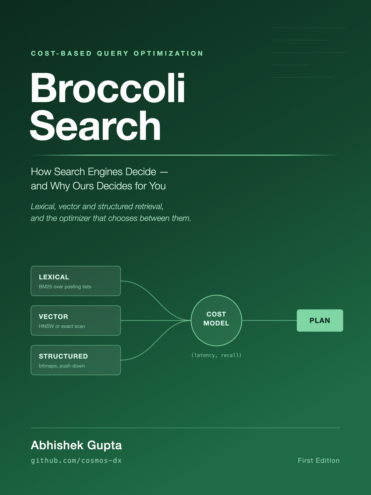
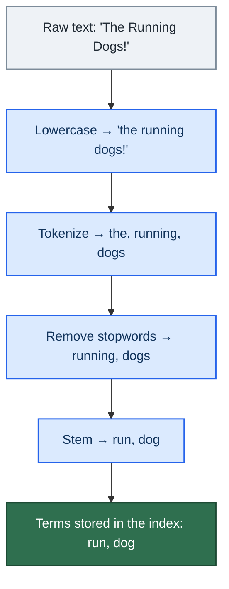
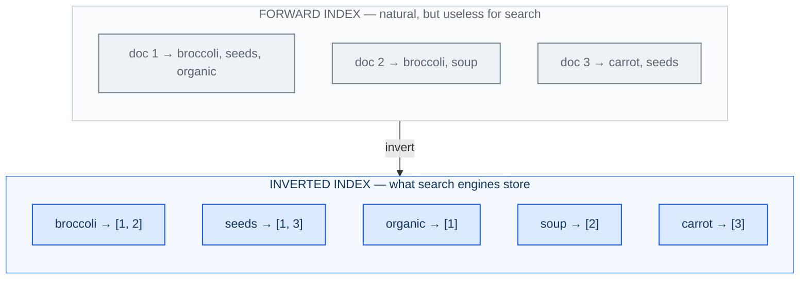
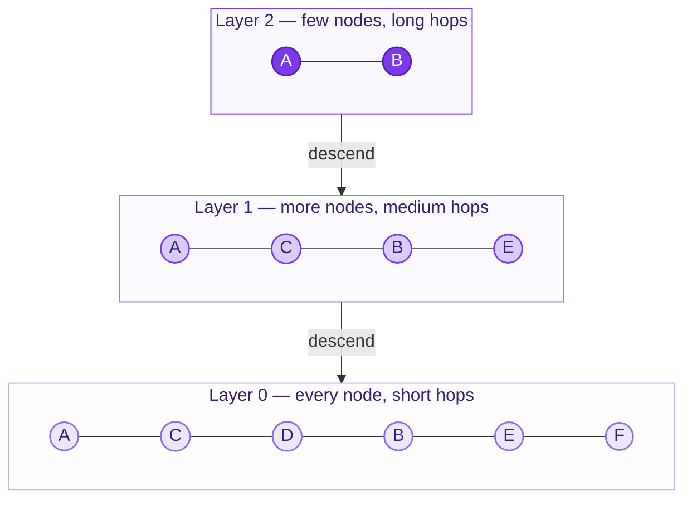
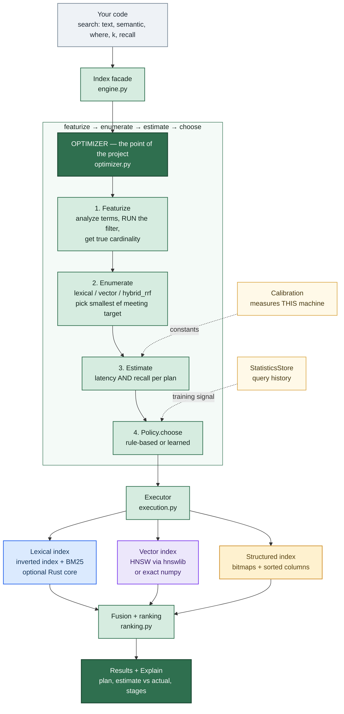
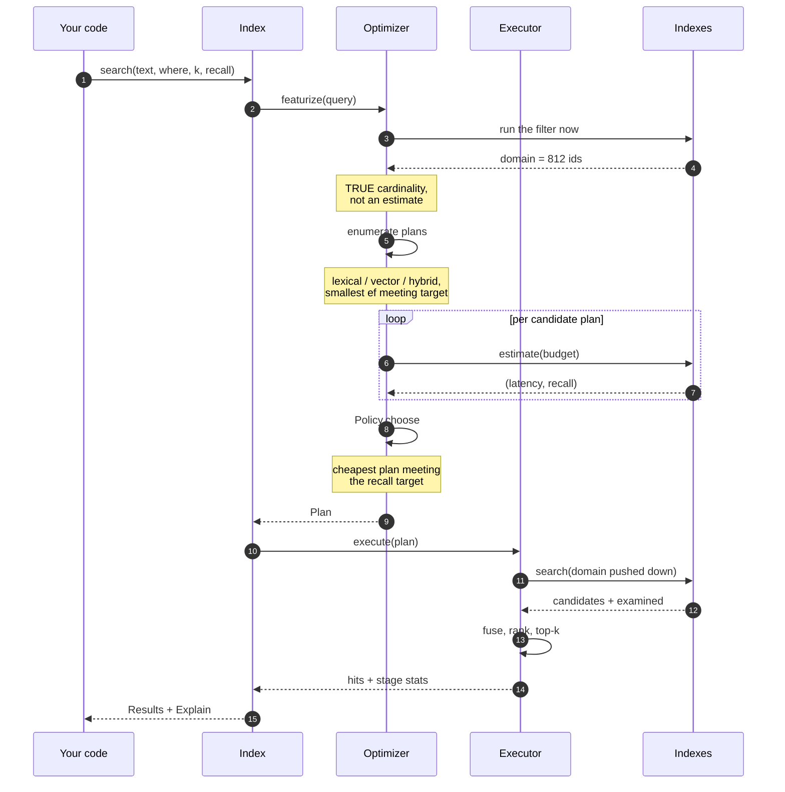
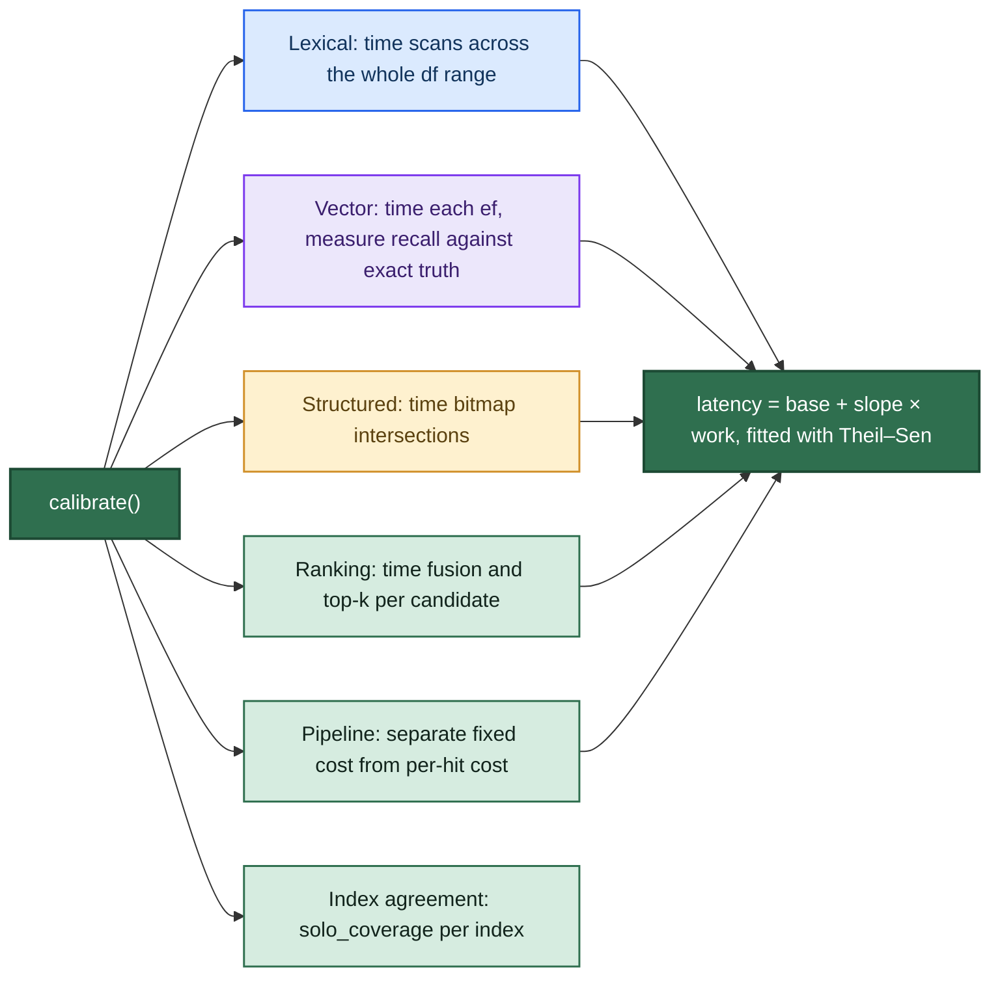
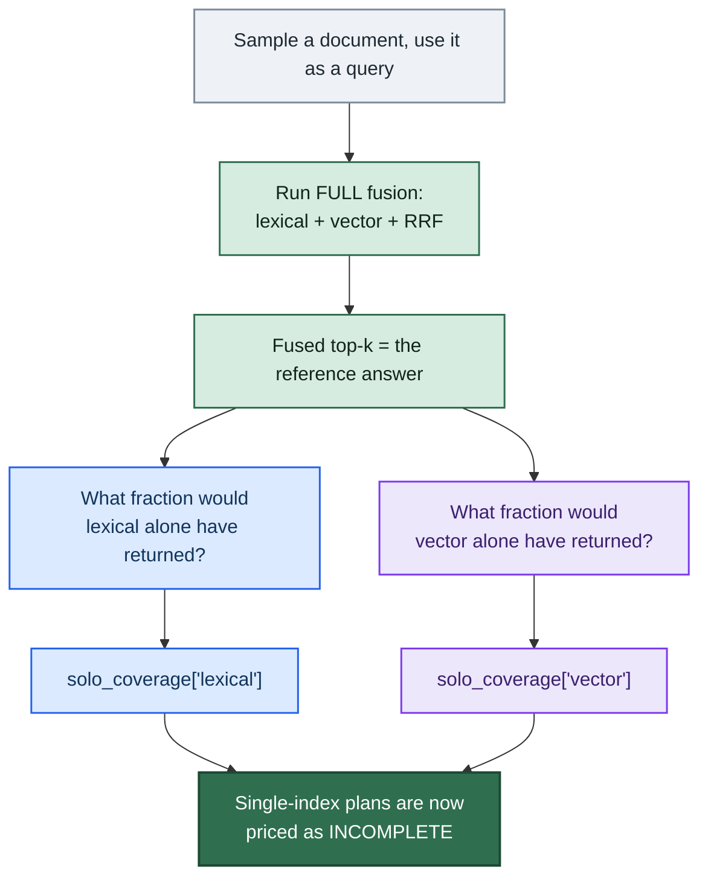
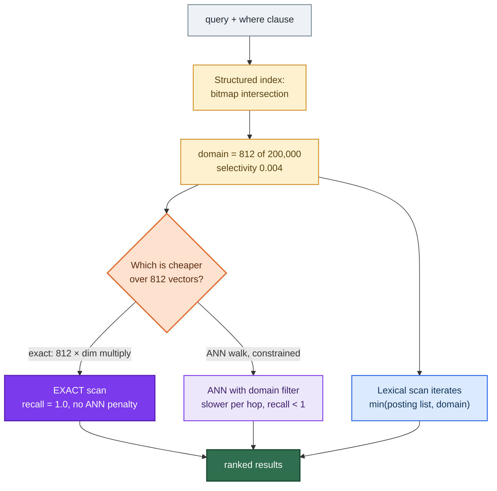
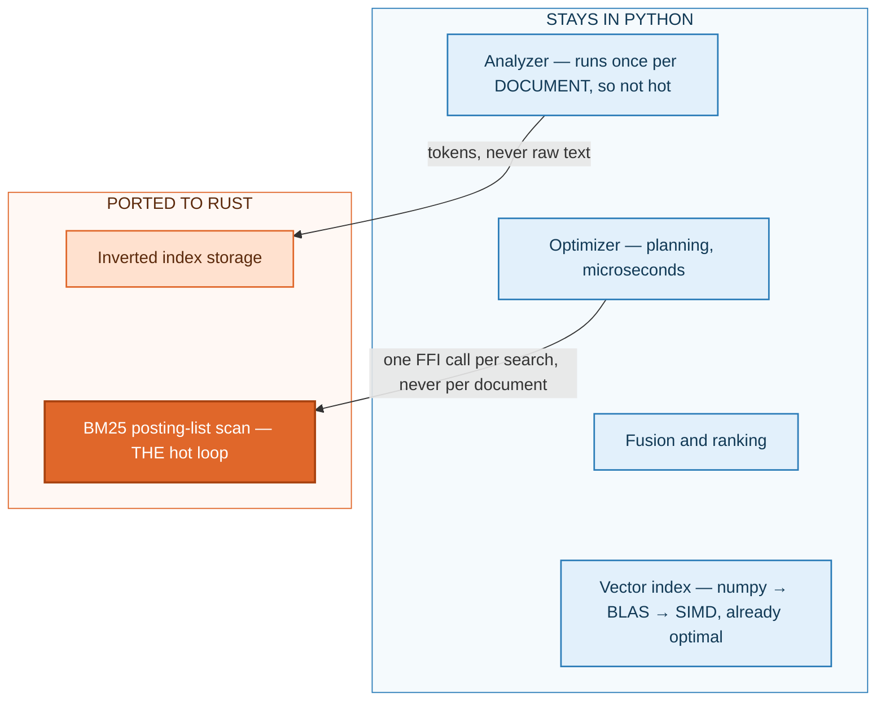

<div class="cover">

</div>

<div class="titlepage">

# BroccoliSearch

## How Search Engines Decide — and Why Ours Decides for You

*Lexical, vector and structured retrieval,<br/>and the cost-based optimizer that chooses between them.*

**Abhishek Gupta**

`github.com/cosmos-dx`

First Edition

</div>

<div class="copyright">

**BroccoliSearch — How Search Engines Decide, and Why Ours Decides for You**

First Edition, 2026.

Copyright © 2026 Abhishek Gupta. All rights reserved.

Written by **Abhishek Gupta** — `github.com/cosmos-dx`

The software this book describes, BroccoliSearch, is released under the **MIT
License**. The source, the evaluation scripts and the Markdown source of this
book live in the project repository; the book and the code are versioned
together on purpose, so that a claim and the program that produces it cannot
drift apart.

**On the numbers in this book.** Every measured figure is produced by a named
script in the repository, and every one is quoted with its limitations. Results
were measured on a single developer machine; the cost model is calibrated per
machine by design, so your constants will differ and some close decisions may
land differently. Where a claim is untested, the book says so rather than
rounding up.

**Trademarks.** Elasticsearch, OpenSearch, Lucene, Solr, PostgreSQL, Pinecone,
Weaviate, Qdrant, Milvus, Vespa, Algolia and other product names are the
property of their respective owners and are referred to here only descriptively.

Typeset from Markdown by the project's own `build_book.py`. See the Colophon.

</div>

<div class="dedication">

*For anyone who has ever hardcoded a retrieval strategy at 2 a.m.,*
*shipped it, and quietly wondered whether it was the right one*
*for every query it would ever see.*

</div>

# Preface

This book exists because of a question I could not answer.

Every hybrid search pipeline I had written looked roughly the same: run BM25,
run a vector search, fuse the results, return the top ten. It worked. But I could
not explain why that pipeline was the right one for *any particular query* — only
that it was the pipeline I had written, and that it ran for all of them equally.
A query that was a product code and a query that was a paragraph of prose got the
identical treatment, and it was obvious that at least one of them was being
served badly.

Relational databases stopped doing this in the 1970s. You do not tell PostgreSQL
which index to scan; you state what you want, and a cost-based optimizer consults
statistics about your actual data and decides. Search engines, which have
execution machinery of extraordinary quality, mostly never grew that layer. The
strategy is still a thing a human writes down once, in a config file, for all
queries forever.

So I built the missing layer to find out whether it was a good idea. This book is
both the textbook I wanted while doing it and the honest report of what happened
— including an entire chapter about the time the optimizer was confidently
optimizing the wrong quantity, and another about discovering that the benchmark I
was using to prove improvements was itself unreproducible.

I have tried to write the book I would have wanted at the start: one that assumes
no background, defines every term before using it, shows the mathematics rather
than gesturing at it, and never quotes a number without saying how it was
measured and where it stops being true.

**A note on honesty.** The project has a rule that a measured number must be
reported with its limits, and this book keeps it. You will find results here that
are unflattering: a headline win that shrinks on real data, a cost model whose
error is larger than I would like, and a central mechanism that remains
unvalidated on a real corpus. They are in here because a system whose entire
premise is *predicting its own cost* has no business hiding the cases where the
prediction is poor.

*Abhishek Gupta*
`github.com/cosmos-dx`

# How to read this book

**Who it is for.** Anyone who wants to understand modern search from the ground
up. It assumes you can read a little Python and remember what a logarithm is. It
assumes **nothing** about information retrieval, embeddings, databases, or Rust.
Every technical term is defined the first time it appears, and there is a full
glossary in Appendix A.

**What you will be able to do afterwards.** Explain how a search engine finds
documents; write down and interpret the BM25 formula; explain what an embedding
is and why approximate nearest-neighbour search exists; read a query plan;
understand what a cost-based optimizer is and why databases have had one for
forty years while search engines have not; and use this library.

**Three routes through it.**

| If you want to… | Read |
|---|---|
| Learn how search works, from nothing | Chapters 1–13, in order |
| Understand what is new here | Chapters 14–16, then 17–23 |
| Just use the library | Chapters 28–34, and Chapter 40 |
| Judge whether it works | Chapters 35–40, which hold every measured number |

Chapters 1–16 are the field: the problem, the vocabulary, the mathematics, and
where the market stands. Chapters 17–40 are this specific system.

**Conventions.** Code that you can run appears in blocks like this:

```python
idx.search(text="organic seeds", k=10, recall=0.9)
```

Quantities carrying a precise meaning are set as `code`, mathematics is displayed
in full, and every diagram is numbered as a Figure. Boxed asides marked with a
vertical rule contain the single most important idea of their section:

> A claim in this book is either measured by a named script in the repository, or
> explicitly labelled as untested.

# Table of contents

*Preface · How to read this book · List of figures*

**The Problem** · chapters 1–4
1. What "search" actually is
2. Two ways to match, and why neither wins
3. The market today
4. The specific pain: strategy is hardcoded

**Foundations** · chapters 5–13
5. From text to terms: analysis
6. The inverted index
7. BM25, derived and explained
8. Embeddings and vector search
9. Approximate nearest neighbours and HNSW
10. Structured indexes, bitmaps and selectivity
11. Combining rankings: fusion and RRF
12. Measuring quality: recall, precision, nDCG, MRR
13. What databases have that search engines don't

**The Gap** · chapters 14–16
14. What each system decides for you
15. The gap, stated precisely
16. Why nobody has closed it

**What BroccoliSearch Does** · chapters 17–23
17. The thesis and the architecture
18. The life of a query
19. The cost model
20. Calibration: measuring your machine
21. Fidelity is not relevance
22. Policies: rules, tie-breaks, and learning
23. Filter push-down

**The Native Core** · chapters 24–27
24. Why Rust, what PyO3 is
25. What was ported, and what deliberately was not
26. The bug the port caused
27. The bit-identical guarantee

**Using the Library** · chapters 28–34
28. Installation
29. Hello, search
30. Filters
31. Reading the plan with `explain`
32. Evaluating with judgments
33. The learned policy
34. Persistence, updates and deletes

**Results and Honest Limits** · chapters 35–40
35. The synthetic workload
36. Real judged data: BEIR
37. How wrong is the cost model?
38. What the Rust core changed
39. Limitations and open problems
40. When to use this, and when not to

**Appendices**
A. Glossary
B. Formula sheet
C. Repository map
D. Regenerating this document as a PDF
E. Further reading
F. Index

*Colophon · About the Author*


# List of figures

| Figure | | Chapter |
|---|---|---|
| 5.1 | The analysis pipeline | 5 |
| 6.1 | Inverting the index | 6 |
| 9.1 | HNSW as a graph with express lanes | 9 |
| 17.1 | System architecture | 17 |
| 18.1 | The life of a query | 18 |
| 20.1 | Calibration against the real machine | 20 |
| 21.1 | Measuring `solo_coverage` without judgments | 21 |
| 23.1 | Filter push-down | 23 |
| 25.1 | What crosses into Rust | 25 |


# Chapter 1 — What "search" actually is

Strip away the interface and search is one question:

> Given a **corpus** of documents and a **query**, return the *k* documents most
> likely to satisfy the person who asked.

Three words in that sentence carry the whole field.

**Corpus** — the collection you search over. It might be 5,000 scientific
abstracts, 200 million products, or the log lines your servers emitted in the
last hour.

**Document** — one retrievable unit, and this is a design decision rather than a
fact. If you index a book as one document, a search returns books. If you index
each paragraph, a search returns paragraphs. Choosing the unit is choosing what
an answer looks like.

***k*** — you almost never want every match. You want the ten best. This is why
search is a *ranking* problem and not a *filtering* problem: the hard part is not
finding the 40,000 documents containing the word "python", it is deciding which
ten to show.

The last part — "most likely to satisfy the person who asked" — is the reason
search is difficult. The engine sees a string. It does not see the intent behind
the string. Everything that follows is an attempt to approximate intent with
arithmetic.

## The two costs of an answer

Every search system trades off two quantities, and holding one constant while
improving the other is what "making search better" means:

- **Quality** — are these the right documents? Measured with metrics defined in
  Chapter 12.
- **Cost** — how much work did it take? Measured in milliseconds, or in this book
  more often in *work units* (Chapter 19), because milliseconds in Python swing
  with cache temperature while work units do not.

A system that returns perfect results in four seconds is useless for a search
box. A system that answers in one millisecond with the wrong documents is worse
than useless, because it looks like it is working.


# Chapter 2 — Two ways to match, and why neither wins

There are two fundamentally different ways to decide whether a document matches a
query, and modern search is largely the story of their rivalry.

## Lexical matching: do the words appear?

The document contains the words. "Broccoli seeds" matches a document containing
"broccoli" and "seeds". This is what Google was in 1999, what Elasticsearch does
by default, and what BM25 (Chapter 7) scores.

It is **exact, explainable and cheap**. If a user searches for the product code
`OD0147`, lexical matching finds precisely the document containing that string,
and you can point at the reason.

Its failure is the **vocabulary mismatch problem**: a document about "cardiac
arrest" does not contain the word "heart attack", so a lexical engine scores it
zero, even though it is exactly what the user wanted.

## Semantic matching: does it mean the same thing?

Convert both the query and the documents into lists of numbers — **vectors** —
positioned so that things with similar *meaning* land near each other. Then
"nearby" means "relevant". This is what embeddings do (Chapter 8), and it solves
vocabulary mismatch directly: "heart attack" and "cardiac arrest" land in
approximately the same place.

Its failure is the mirror image. An embedding is a lossy summary of meaning, and
a product code has no meaning to summarise. Ask a vector index for `OD0147` and
it returns documents that are *vaguely code-like*, because it has no mechanism
for exactness. It also cannot explain itself: the document scored 0.83 and no
human can say why.

## The honest summary

| | Lexical (BM25) | Semantic (vectors) |
|---|---|---|
| Matches | exact words and their stems | meaning |
| Exact identifiers, codes, names | **excellent** | **poor** |
| Paraphrases, synonyms, descriptions | **poor** | **excellent** |
| Explainable | yes — you can name the term | no |
| Needs a trained model | no | yes |
| Cost driver | how common the words are | corpus size and vector dimension |
| New/rare words | handled natively | may be unrepresented by the model |

Neither is better. They fail on **different queries**, which is precisely why
running both and combining them ("hybrid search") became standard practice — and
precisely why doing that unconditionally is wasteful, which is where this project
starts.


# Chapter 3 — The market today

Understanding where BroccoliSearch fits requires knowing what already exists.
These systems are mature, widely deployed, and mostly excellent at what they do.

## The lexical incumbents

**Apache Lucene** is the Java library underneath most of this list: inverted
indexes, BM25 scoring, analyzers. Twenty-plus years old and still the reference
implementation.

**Elasticsearch** and **OpenSearch** wrap Lucene in a distributed, JSON-over-HTTP
service with sharding, replication and aggregations. Together with Logstash
(ingest) and Kibana (visualisation) this is the **ELK stack**, the default for log
search. Its speed comes from the inverted index (Chapter 6) plus aggressive
caching and per-shard parallelism.

**Solr** is the other long-standing Lucene server. **Typesense** and
**MeiliSearch** are modern, typo-tolerant, developer-friendly engines aimed at
site search. **Algolia** is the hosted version of that idea, optimised hard for
sub-50ms as-you-type search.

## The vector-native wave

Since embeddings became cheap, a category of database appeared whose primary
index is a vector index: **Pinecone** (hosted), **Weaviate**, **Qdrant**,
**Milvus**, and **Chroma**. They store vectors, run approximate nearest-neighbour
search (Chapter 9), and increasingly support metadata filters and a keyword index
alongside.

**FAISS** (Meta) and **hnswlib** are the libraries rather than services — the ANN
algorithms themselves. This project *rents* `hnswlib` rather than reimplementing
HNSW, which is the correct decision: that code is excellent and the algorithm is
not the novel part here.

## The databases that grew vector support

**pgvector** adds vector columns and ANN indexes to PostgreSQL. **SQLite** has
extensions doing the same. Their advantage is enormous and often decisive: your
data is already there, and you get transactions, joins and a real query planner
for the structured part of the problem.

## The specialists and the glue

**Vespa** (Yahoo) is the closest large system to what this book argues for: it
runs lexical, vector and structured matching in one engine with a rich ranking
framework and genuine phased ranking. **LangChain** and **LlamaIndex** are not
engines at all — they are orchestration libraries that call the above, and they
are where most RAG pipelines actually express their retrieval strategy.

## What they have in common

Almost every system in that list is superb at *executing* a retrieval strategy.
The strategy itself — which indexes to consult, how many candidates to fetch, how
to combine the results — is something **you** write down, in code or in a query
DSL, and it then applies to every query equally.


# Chapter 4 — The specific pain: strategy is hardcoded

Here is the shape of a typical production retrieval function. It is not a straw
man; it is close to what most RAG stacks and hybrid search deployments actually
run.

```python
def search(query_text, k=10):
    # Someone decided this, once, for all queries, forever.
    bm25_hits  = lexical_index.search(query_text, top_n=100)
    vector_hits = vector_index.search(embed(query_text), top_n=100, ef=128)
    fused = reciprocal_rank_fusion(bm25_hits, vector_hits)
    return fused[:k]
```

This code is *correct*. It is also, for a large fraction of real queries,
**doing roughly twice the work it needs to**, and for another fraction it is
returning worse answers than a simpler approach would.

Consider three queries hitting that function.

**Query 1: `OD0147`** — a product code. The lexical index finds it immediately;
its posting list (Chapter 6) has maybe eleven entries, so the scan touches eleven
documents. Meanwhile the vector search embeds the string, walks a graph over the
entire corpus, and returns documents that are *nothing like* what was asked for,
because a code has no semantics. Then fusion mixes those useless results into the
ranking. We paid for a full ANN search and a fusion pass to *degrade* an answer
that BM25 had already nailed.

**Query 2: "something to help my tomato plants grow better"** — no useful exact
terms. Every word is common: "help", "grow", "better" appear in a large fraction
of documents, so the BM25 scan drags enormous posting lists through memory to
produce a weak ranking. The vector index answers this well. The lexical half was
expensive *and* unhelpful.

**Query 3: "organic seeds" filtered to `status = active AND price < 10`** — the
filter matches only 812 of 200,000 documents. Approximate nearest-neighbour
search over a 0.4% subset is both slower *and* less accurate than simply
computing exact similarity against 812 vectors — a trivial matrix multiplication.
The hardcoded `ef=128` is now actively harmful, and no line in that function can
notice.

Three queries, three different correct strategies, one hardcoded pipeline.

## The idea

Databases solved this problem in the 1970s. You do not tell PostgreSQL to use an
index scan on `users_email_idx` and then hash-join against `orders`. You write
`SELECT ... WHERE ...` — you state **what you want** — and a **query optimizer**
estimates the cost of each possible execution plan and picks one, per query,
using statistics about your actual data.

> **The thesis of this project:** search should work the same way. You state
> intent and constraints; the engine decides which indexes to touch, how many
> candidates to retrieve, whether to approximate, and how to rank.

That is what BroccoliSearch is. Everything in Chapters 17–23 is a consequence of taking
that sentence seriously — including the parts where it turned out to be harder
than it sounds.


# Chapter 5 — From text to terms: analysis

*Chapters 5 to 13 define every term and every formula used later. If you already
know information retrieval, skim to Chapter 13; if you know databases too, skip
to Chapter 14.*

Computers match byte strings; humans do not. Before a document can be indexed its
text is put through an **analyzer**, a pipeline that turns prose into a list of
normalised **terms** (also called **tokens**).



<p class="caption"><strong>Figure 5.1</strong> — The analysis pipeline. The same
pipeline must run at index time and at query time, or terms never match.</p>

**Lowercasing** so `Dogs` and `dogs` are one term.

**Tokenization** — splitting into words. Harder than it looks: is `state-of-the-art`
one token or four? Is `C++` a token or an empty string? This library uses a
regular expression over alphanumerics, which is the simple, boring choice.

**Stopword removal** — dropping words so common they carry no signal ("the", "of",
"and"). Cheaper index, but it means a search for the band "The The" cannot work.

**Stemming** — reducing inflected forms to a common root, so `running`, `runs` and
`ran` all become one term. Real stemmers (Porter, Snowball) are intricate; this
library uses light suffix-stripping, which is explicitly marked in the source as a
simplification.

> **The critical invariant.** *The same analyzer must run at index time and at
> query time.* If documents are stemmed to `garden` but the query keeps
> `gardening`, the term never matches and recall silently collapses. This is one
> of the most common serious bugs in search systems, and Chapter 27 describes how
> it nearly slipped into this codebase's own test suite.


# Chapter 6 — The inverted index

Once you have terms, you need to find documents by term without reading every
document. The **inverted index** is the data structure that makes this possible,
and it is the single reason keyword search is fast.

A *forward* index maps documents to their terms — the natural direction, and
useless for search, because answering "who contains `broccoli`?" means reading
everything. Invert it:



<p class="caption"><strong>Figure 6.1</strong> — Inverting the index. Answering
"which documents contain <em>broccoli</em>?" becomes a single lookup instead of a
scan of the whole corpus.</p>

The list attached to each term is its **posting list**, and each entry is a
**posting**. In this library a posting stores the document id and the **term
frequency** (`tf`) — how many times the term occurs in that document — because
BM25 needs it.

Two quantities from this structure appear constantly for the rest of the book:

- **Document frequency, `df(t)`** — how many documents contain term `t`; the
  length of its posting list. `df("the")` might be 90% of the corpus;
  `df("OD0147")` might be 11.
- **Collection size, `N`** — the number of documents.

**Why search is fast:** answering a query means reading the posting lists of the
query's terms and nothing else. A two-word query against a 200,000-document
corpus where each term appears in 500 documents touches ~1,000 postings, not
200,000 documents. That is a 200× saving, and it is the whole trick.

**Why search is sometimes slow:** that saving is proportional to how *rare* your
terms are. A query for common words has posting lists as long as the corpus, and
the inverted index degenerates into a full scan with extra steps. This is the
single most important fact for the cost model in Chapter 19 — the cost of a
keyword query is not constant, it is `Σ df(t)`, and it varies by four orders of
magnitude between queries against the same index.


# Chapter 7 — BM25, derived and explained

Finding candidate documents is not enough; they must be ranked. **BM25** ("Best
Match 25") is the scoring function that has been the strong baseline for thirty
years. Modern neural rankers beat it, but not by as much as you would expect, and
it is essentially free.

BM25 sums a contribution from each query term:

$$
\text{score}(q, d) \;=\; \sum_{t \in q} \text{IDF}(t)\;\cdot\;
\frac{tf_{t,d}\,(k_1 + 1)}{tf_{t,d} + k_1\left(1 - b + b\,\dfrac{|d|}{\text{avgdl}}\right)}
$$

It is assembled from three intuitions.

## Intuition 1: rare words matter more — IDF

If a document matches "the", that tells you nothing. If it matches "OD0147", that
tells you almost everything. **Inverse document frequency** turns rarity into
weight:

$$
\text{IDF}(t) \;=\; \ln\!\left(1 + \frac{N - df(t) + 0.5}{df(t) + 0.5}\right)
$$

A term in 10 of 100,000 documents scores roughly `ln(9091) ≈ 9.1`; a term in half
the corpus scores about `ln(2) ≈ 0.69`. The `+0.5` terms are smoothing that keeps
the expression finite at the extremes, and the outer `1 +` guarantees the result
is never negative — without it, a term appearing in more than half the corpus
would score below zero and *subtract* from relevance.

## Intuition 2: more occurrences matter, but with diminishing returns

A document mentioning "broccoli" ten times is more about broccoli than one
mentioning it once. A document mentioning it a thousand times is not a hundred
times better than the ten — it is probably spam. So raw `tf` is passed through a
**saturating** function:

$$
\frac{tf\,(k_1+1)}{tf + k_1}
$$

As `tf` grows this approaches `k₁ + 1` and stops. The parameter **`k₁`
(default 1.2)** sets how quickly saturation kicks in. `k₁ = 0` would ignore
frequency entirely; large `k₁` approaches raw counting.

## Intuition 3: long documents cheat

A 10,000-word document contains many terms by accident. Dividing by document
length would over-correct, so BM25 interpolates using **`b` (default 0.75)**:

$$
1 - b + b\,\frac{|d|}{\text{avgdl}}
$$

where `|d|` is the document's length in terms and `avgdl` is the corpus average.
`b = 0` disables length normalisation; `b = 1` applies it fully; 0.75 is the
long-standing empirical default.

## In this codebase

The implementation is a direct transcription, and the constants are the standard
defaults:

```python
# broccoli/indexes/lexical.py
K1 = 1.2
B = 0.75

idf = math.log(1.0 + (n - df + 0.5) / (df + 0.5))
denom = tf + K1 * (1 - B + B * dl / avgdl)
scores[doc_id] = scores.get(doc_id, 0.0) + idf * (tf * (K1 + 1)) / denom
```

**Why this matters for the rest of the book:** BM25 scores are *unbounded and
corpus-dependent*. A score of 14.2 means nothing on its own and cannot be
compared to a cosine similarity of 0.83. That incomparability is exactly why
fusion (Chapter 11) has to work on *ranks* rather than scores.


# Chapter 8 — Embeddings and vector search

An **embedding** is a function mapping a piece of text to a fixed-length list of
floating-point numbers — a **vector** — such that texts with similar meaning map
to nearby vectors.

The mapping is learned. A neural network is trained on hundreds of millions of
text pairs with an objective that pulls related texts together and pushes
unrelated ones apart. The model used throughout this project's evaluations is
`sentence-transformers/all-MiniLM-L6-v2`, which produces **384-dimensional**
vectors; OpenAI's `text-embedding-3-small` produces 1,536.

The **dimension** is how many numbers describe each text. Nobody can say what any
individual dimension means — the model chose them — but geometry in that space
corresponds to meaning, which is all we need.

## Measuring nearness

**Cosine similarity** — the angle between two vectors, ignoring their lengths.
This is the default here and the usual choice for text, because document length
should not affect similarity:

$$
\cos(u, v) \;=\; \frac{u \cdot v}{\|u\|\,\|v\|}
\;=\; \frac{\sum_i u_i v_i}{\sqrt{\sum_i u_i^2}\;\sqrt{\sum_i v_i^2}}
$$

Its range is −1 (opposite) to 1 (identical direction).

**Dot product** — the same numerator without normalisation, so vector magnitude
counts. **Euclidean (L2) distance** — straight-line distance. On
length-normalised vectors these produce identical rankings, which is why this
library normalises once at build time and then uses a plain matrix multiply.

## Exact search, and why it doesn't scale

Finding the nearest vectors exactly means computing similarity against every
document:

```python
similarities = corpus_matrix @ query_vector    # (N, dim) @ (dim,) -> (N,)
top_k = np.argpartition(similarities, -k)[-k:]
```

This is `O(N · dim)`. For 10,000 documents at 384 dimensions it is a
3.8-million-element matrix multiply, which BLAS — the tuned linear-algebra library
underneath NumPy — finishes in well under a millisecond using SIMD instructions
that process several floats per CPU cycle. For 100 million documents it is
hopeless.

Two facts from this that matter later: exact search is **perfect** (it cannot
miss a neighbour) and it is **linear in the number of vectors you scan**. Shrink
the set of vectors and exact search becomes viable again — which is exactly what
a filter does, and Chapter 23 exploits it.


# Chapter 9 — Approximate nearest neighbours and HNSW

To search a hundred million vectors quickly, you must give something up.
**Approximate nearest neighbour (ANN)** search does: it finds *most* of the true
nearest neighbours, much faster, and lets you choose the trade-off.

## HNSW

**Hierarchical Navigable Small World** graphs are the dominant ANN algorithm and
what `hnswlib` implements. The idea is a navigable graph with express lanes.



<p class="caption"><strong>Figure 9.1</strong> — HNSW as a graph with express
lanes. Upper layers cross the space in a few long hops; layer 0 does the
fine-grained work. Search cost is logarithmic rather than linear.</p>

Every vector lives in layer 0. Each higher layer holds a random subset with
longer-range links. A search enters at the top, greedily walks toward the query
until it cannot improve, drops a layer, and repeats. The upper layers cross the
space in a few hops; the bottom layer does the fine-grained work. Search cost is
roughly **logarithmic** in the number of vectors rather than linear.

## The two parameters you must know

**`M`** — how many neighbours each node links to. Set at build time. Higher `M`
means a better-connected graph, better recall, more memory.

**`ef`** (short for `ef_search`) — how many candidates the search keeps in its
priority queue while walking. **Set per query.** This is the recall/latency dial:
low `ef` is a fast, narrow walk that may miss true neighbours; high `ef` explores
more and finds more.

This library ladders `ef` through `(16, 32, 64, 128, 256)`.

## The recall curve

Here **recall** means *operator fidelity*: of the true `k` nearest neighbours,
what fraction did the approximate search return? It is not a fixed property of the
index — it is a **curve** traced by `ef`:

| `ef` | typical recall | relative latency |
|---|---|---|
| 16 | ~0.85 | 1× |
| 64 | ~0.97 | ~2× |
| 256 | ~0.999 | ~5× |

Every ANN system asks you to pick a point on this curve, usually once, in a config
file. **This curve is the reason the optimizer in Chapter 19 can exist:** it is a
tunable knob with a measurable cost and a measurable benefit, which is precisely
the input a cost model needs. This library *measures* the curve on your machine
and your data at calibration time, then picks the smallest `ef` that meets the
recall you asked for, per query.

> Note the terminology trap, because it causes a real bug in Chapter 21: ANN
> "recall" measures whether the operator computed *its own function* faithfully.
> It says nothing about whether the documents are *relevant*. A perfect vector
> scan has recall 1.0 while missing every document that only keyword search could
> find.


# Chapter 10 — Structured indexes, bitmaps and selectivity

Search queries usually carry constraints that have nothing to do with text:
`status = "active"`, `price < 10`, `city = "BLR"`, `created_at > 30 days ago`.
These are handled by a **structured index**, and the classic implementation is the
**bitmap index**.

For each value of a low-cardinality field, store a bit per document:

```
status = "active"    →  1 1 0 1 0 0 1 ...
status = "archived"  →  0 0 1 0 1 1 0 ...
```

Combining predicates is then bitwise AND/OR, which modern CPUs perform 64 bits at
a time. `active AND in_stock` over a million documents is a few thousand machine
words. Production systems use **Roaring bitmaps**, a compressed format that stays
fast; this library uses Python sets, which is the same idea with worse constants
and is marked as such in the source.

Numeric ranges use a **sorted column** — values kept in order so `price < 10`
becomes a binary search plus a slice, `O(log N + m)` instead of `O(N)`.

## Selectivity and cardinality — the vocabulary of cost

These two words come from databases and are used constantly from Chapter 17 onwards.

**Cardinality** — the *number of rows* an operation produces. `status = "active"`
might have cardinality 812.

**Selectivity** — that number as a *fraction* of the corpus. 812 of 200,000 is a
selectivity of 0.004, i.e. the filter keeps 0.4%.

A database optimizer estimates these from histograms, and mis-estimation is the
main reason bad query plans happen. This system has an advantage worth stating
plainly: **it runs the filter first and therefore knows the true cardinality
rather than estimating it** (Chapter 18). Bitmap intersection is cheap enough that
executing the filter costs less than the error of guessing its result would.


# Chapter 11 — Combining rankings: fusion and RRF

If lexical and vector search each return 100 documents, how do you produce one
ranking? You cannot average the scores: BM25 returns unbounded values like 14.2
while cosine returns 0.83, and normalising them requires assumptions about their
distributions that are usually wrong.

**Reciprocal Rank Fusion (RRF)** sidesteps the problem by throwing the scores away
and keeping only the **ranks**:

$$
\text{RRF}(d) \;=\; \sum_{i \in \text{lists}} \frac{1}{k + \text{rank}_i(d)}
\qquad k = 60
$$

A document ranked 1st by BM25 and 5th by vector search scores
`1/61 + 1/65 ≈ 0.0318`. A document ranked 1st by one and absent from the other
scores `1/61 ≈ 0.0164`. Appearing in *both* lists is rewarded; the constant `k`
(conventionally 60) flattens the difference between top ranks so that being 1st
versus 2nd does not dominate.

RRF is about ten lines of code, has no parameters to tune per corpus, and is a
notoriously strong baseline. The implementation here is the formula verbatim:

```python
# broccoli/ranking.py
RRF_K = 60

def rrf(candidate_sets, k=RRF_K):
    fused = {}
    for cs in candidate_sets:
        ranked = sorted(cs.scores.items(), key=lambda kv: kv[1], reverse=True)
        for rank, (doc_id, _) in enumerate(ranked, start=1):
            fused[doc_id] = fused.get(doc_id, 0.0) + 1.0 / (k + rank)
    return fused
```

**Fusion is not free**, which is the point the optimizer cares about. It requires
running *every* retrieval branch, then sorting and merging their outputs. On the
BEIR SciFact dataset, fusion costs about **5× the work** of a single-index plan
(Chapter 36). Whether that is worth paying is a per-query question, and answering
it automatically is what this project is for.


# Chapter 12 — Measuring quality: recall, precision, nDCG, MRR

You cannot optimize what you cannot measure, and search quality is measured
against **judgments** — queries paired with the documents a human marked
relevant.

Let `R` be the set of relevant documents and let the system return a ranked list;
`@k` means we look only at the top `k`.

**Recall@k** — of everything relevant, what fraction did we return?

$$
\text{Recall@}k = \frac{|\{\text{top }k\} \cap R|}{|R|}
$$

**Precision@k** — of what we returned, what fraction was relevant?

$$
\text{Precision@}k = \frac{|\{\text{top }k\} \cap R|}{k}
$$

Neither cares about **order**, which is a serious weakness: putting the one
relevant document at rank 10 scores the same as rank 1.

**nDCG@k** — *normalised discounted cumulative gain*, the metric that does care.
Each result has a **gain** `g` (its relevance grade, often just 0 or 1),
discounted by the logarithm of its position:

$$
\text{DCG@}k = \sum_{i=1}^{k} \frac{g_i}{\log_2(i+1)}
\qquad\qquad
\text{nDCG@}k = \frac{\text{DCG@}k}{\text{IDCG@}k}
$$

`IDCG` is the DCG of the perfect ranking, so nDCG is 1.0 for a perfect result and
comparable across queries with different numbers of relevant documents. **This is
the primary quality metric in this book**, and it is what the learned policy in
Chapter 22 is trained to predict.

**MRR** — mean reciprocal rank: `1/rank` of the first relevant document. The right
metric when there is exactly one correct answer, such as a lookup by product code.

All four are implemented in `broccoli/eval.py` and used by the harness in
Chapter 32:

```python
def ndcg_at_k(retrieved, relevance, k):
    gains = [relevance.get(doc_id, 0.0) for doc_id in retrieved[:k]]
    dcg = sum(g / math.log2(i + 2) for i, g in enumerate(gains))
    ideal = sorted(relevance.values(), reverse=True)[:k]
    idcg = sum(g / math.log2(i + 2) for i, g in enumerate(ideal))
    return (dcg / idcg) if idcg > 0 else 0.0
```

> **Two different meanings of "recall".** This is the single most confusing
> overload in the field, and Chapter 21 is entirely about a bug caused by it.
> *Retrieval recall* (this chapter) asks whether the returned documents are the
> **relevant** ones, and requires human judgments. *Operator recall* (Chapter 9)
> asks whether an approximate algorithm faithfully computed **its own function**,
> and requires no judgments at all. They are not the same number, and optimizing
> the second while believing you are optimizing the first is a mistake this
> project made and had to fix.


# Chapter 13 — What databases have that search engines don't

The last piece of background is the one this project borrows wholesale.

When you run a SQL query, you do not specify an algorithm. You write:

```sql
SELECT * FROM users u JOIN orders o ON u.id = o.user_id
WHERE u.country = 'IN' AND o.total > 100;
```

The database then performs four steps that map exactly onto Chapters 17–23.

**1. Enumerate plans.** Index scan or sequential scan? Which table first? Hash
join, merge join, or nested loop? There may be thousands of candidate plans.

**2. Estimate cost.** Using **statistics** — table sizes, histograms, index
selectivity — the optimizer predicts how many rows each step produces and how much
I/O and CPU it costs. Cost is a made-up unit calibrated so the numbers are
comparable.

**3. Choose.** Take the cheapest plan that computes the right answer.

**4. Explain.** `EXPLAIN ANALYZE` prints the chosen plan, the estimated row counts
and the actual ones, so a human can see where the model was wrong.

Three ideas from this tradition carry over directly:

**Cardinality estimation** — knowing how many rows survive each step is the input
that everything else depends on. Bad cardinality estimates are the number one
cause of bad plans in real databases.

**Predicate push-down** — apply filters as early as possible, so later stages see
fewer rows. Pushing `country = 'IN'` into the scan beats fetching every user and
discarding most of them.

**Join ordering** — when combining two sets, iterate the *smaller* one and probe
the larger. Getting this backwards can cost orders of magnitude, and Chapter 26
shows the exact bug that results when you get it wrong across a language boundary.

Search engines have **execution** engines of extraordinary quality. What they
mostly do not have is the **planning** layer above it — the part that looks at
this particular query, consults statistics, and decides.


# Chapter 14 — What each system decides for you

With the vocabulary in place, the gap can be stated precisely. For every search
system, ask: **who decides which indexes to consult for this particular query?**

| System | Which index? | Candidate budget? | `ef` / approximation? | Fusion? |
|---|---|---|---|---|
| Elasticsearch / OpenSearch | you, in the query DSL | you | n/a (lexical) | you |
| Elasticsearch + kNN | you (`should` clauses) | you | you (`num_candidates`) | you (`rank`) |
| Pinecone / Weaviate / Qdrant | vector, plus optional keyword you enable | you (`top_k`) | you, or a hosted default | you (`alpha`) |
| pgvector + PostgreSQL | Postgres plans the **SQL**; the vector op is fixed | you (`LIMIT`) | you (`ef_search` GUC) | you, in SQL |
| Vespa | you, in a rank profile; phased ranking is first-class | you | you | you |
| LangChain / LlamaIndex | you, in the retriever config | you | you | you (ensemble weights) |
| **BroccoliSearch** | **the optimizer, per query** | **the optimizer** | **the optimizer, from a measured curve** | **the optimizer** |

The pattern is consistent and it is not an oversight — it is a reasonable design
choice that these systems made deliberately. They are *engines*: they execute
what you specify, extremely well. Configuration is the contract.

Two entries deserve fairness. **pgvector inherits a real cost-based optimizer**
from PostgreSQL, which is genuinely planning — but it plans the *relational* part.
It will choose an index scan over a sequential scan for `WHERE status = 'active'`;
it will not decide that this particular query does not need the vector operator at
all, because from Postgres's perspective the vector operator is just a function in
your `ORDER BY`. And **Vespa** comes closest of the mature systems: it can express
multi-phase ranking, cheap first phases and expensive later ones, in one engine.
That is real planning machinery. It is still a *profile you author* rather than a
per-query decision derived from measured statistics.


# Chapter 15 — The gap, stated precisely

> **There is no cost model that spans heterogeneous index types.**

A database optimizer can compare an index scan to a sequential scan because both
are priced in the same invented currency, calibrated so the numbers mean
something. Search has no equivalent unit that spans a BM25 posting-list scan, an
HNSW graph walk, and a bitmap intersection. So no system compares them
quantitatively; they are simply all executed, or the choice is left to a human who
guesses once and encodes the guess in a config file.

This produces three concrete losses, each of which appears with a measured number
later in this book.

**Loss 1 — Work you did not need.** Running both branches on a query that one
branch answers perfectly. On the synthetic mixed workload of Chapter 35 this is
worth **1.17× in work units**, measured, with the caveat that the fixed strategies
are already getting filter push-down for free.

**Loss 2 — Quality you left behind.** The inverse: using one index where fusion
genuinely retrieves documents the other never sees. Before the fix in Chapter 21
this system gave up **0.046 nDCG on SciFact** by never choosing fusion.

**Loss 3 — A dial you cannot turn.** `recall` should be a *target you request*,
with the engine finding the cheapest way to meet it. In every system in the table
above, recall is an *emergent property* of the strategy you configured. You cannot
ask for "0.99, whatever it takes" on a legal search and "0.7, quickly" on an
autocomplete against the same index.


# Chapter 16 — Why nobody has closed it

The gap is not obvious-and-unclaimed; it is genuinely difficult, in four ways that
this project ran into directly.

**The units do not commensurate.** What is a posting-list scan worth in units of
graph hops? There is no principled answer, only a measured one — and it differs
per machine, per corpus, and per BLAS build. The only way through is to
**calibrate on the actual hardware**, which is Chapter 20.

**The statistics are harder than in a database.** A relational optimizer estimates
selectivity from column histograms. A search optimizer needs to estimate how many
documents a *term* matches (easy — that is `df`) *and* how much of the relevant
set an index will find (hard — that depends on the query's meaning).

**Relevance is not observable at query time.** A database optimizer only has to
predict *cost*, because every valid plan returns the identical rows. A search
optimizer must predict *cost and quality*, and quality depends on human judgment
it does not have. Chapter 21 is about the least-bad way to approximate it without
judgments; Chapter 22 is about doing better when you have them.

**The measurement problem is real.** Sub-millisecond operations in a garbage-
collected interpreted language cannot be timed accurately. When your cost model's
error is 17% and two plans differ by 0.1%, choosing the cheaper is choosing noise.
This bit the project hard enough to need a dedicated mechanism (Chapter 22) and it
is one reason for the Rust core (Chapters 24–27).


# Chapter 17 — The thesis and the architecture

> **You express intent and constraints. The engine chooses the strategy, per
> query, from cost and quality models calibrated on your machine and your data.**

Nothing in the query API names an index or an algorithm. `search(text=...,
semantic=..., where=..., k=..., recall=...)` says *what you want*: some keywords,
some meaning, some constraints, this many results, at least this much recall.
Which index answers it is not your decision.



<p class="caption"><strong>Figure 17.1</strong> — System architecture. Everything
inside the dashed box is the contribution; the retrieval engines below it are
conventional and, in one case, rented.</p>

The components, in one line each:

| Module | Responsibility |
|---|---|
| `engine.py` | Public `Index` facade: create, add, search, calibrate, save |
| `optimizer.py` | **The point.** Featurize, enumerate, cost model, `Policy` |
| `execution.py` | Runs a chosen plan, honours budgets, records stage stats |
| `indexes/lexical.py` | Analyzer, inverted index, BM25, cost estimate |
| `indexes/vector.py` | HNSW + exact path, measured recall curve |
| `indexes/structured.py` | Bitmaps, sorted columns, selectivity |
| `ranking.py` | RRF, weighted fusion, recency decay, top-k heap |
| `calibration.py` | Robust (Theil–Sen) fit of base + marginal cost |
| `eval.py` | Judged-query harness, IR metrics |
| `broccoli-core/` | Optional Rust extension: native inverted index + BM25 |


# Chapter 18 — The life of a query



<p class="caption"><strong>Figure 18.1</strong> — The life of a query. Note step
3: the filter is executed during planning, so the optimizer works from a true
cardinality instead of an estimate.</p>

The step worth pausing on is **the filter runs during planning, not execution**.
This looks like a layering violation and is a deliberate trade. Bitmap
intersection is cheap; guessing its result is not. By executing it first the
optimizer replaces the largest source of error in a database optimizer —
cardinality estimation — with an observed fact, and every later decision is made
knowing the true domain size. The source comments this explicitly:

```python
# Resolve the filter NOW: bitmap intersection is cheap and yields EXACT
# selectivity, which is the single most valuable input to the cost model.
```

## The plans it enumerates

The plan space is deliberately small — three shapes plus a degenerate case:

| Plan | Retrieval steps | Fusion | Chosen when |
|---|---|---|---|
| `lexical` | BM25 scan | none | terms are selective enough to answer alone |
| `vector` | ANN or exact scan | none | intent is semantic, or terms are useless |
| `hybrid_rrf` | both | RRF | the indexes disagree enough that both are needed |
| `filter_only` | none | none | no text and no vector — the filter *is* the answer |

Enumerating three plans rather than thousands is a deliberate simplification.
Databases must enumerate join orders, which grow factorially; here the axes are
few and the win comes from *pricing* them correctly rather than from searching a
large space.


# Chapter 19 — The cost model

Each plan is priced as a **pair**, and this is the central design decision of the
whole system:

$$
\text{estimate} = (\;\text{latency\_ms},\;\; \text{recall}\;)
$$

Not a single scalar. A plan is not simply "cheaper" or "more expensive" — it is
cheaper *and* less complete, and the policy needs both numbers to honour a recall
target.

## Latency

Reading `Optimizer.estimate_plan` directly, total predicted latency is:

$$
\text{latency} = \underbrace{p_0}_{\text{fixed}} +
\underbrace{\sum_{s \in \text{steps}} \ell_s}_{\text{retrieval}} +
\underbrace{[\text{fused}] \cdot n_f c_f}_{\text{fusion}} +
\underbrace{n_f c_r}_{\text{ranking}} +
\underbrace{\min(k, n_f)\, p_1}_{\text{marshalling}}
$$

where `n_f` is the number of candidates flowing into fusion, `c_f` and `c_r` are
measured per-document fusion and ranking costs, and `p₀`/`p₁` are the measured
fixed and per-hit pipeline overheads.

Every one of those constants is **measured on your machine** (Chapter 20), not
hardcoded. Two of the terms exist because getting them wrong caused real
mispredictions, documented in Chapter 37: the filter's survivors were once counted
as candidates to rank (which penalised the very push-down the system exists to
exploit), and marshalling was once priced as `O(k)` rather than
`O(hits actually returned)`.

## Per-index cost

Each index prices its own work, in units natural to it.

**Lexical.** The scan touches the posting list of every query term, unless a
filter domain is smaller, in which case it probes the domain instead — the join
order of Chapter 13:

$$
\text{work} = \sum_{t \in q} \min\bigl(df(t),\, |\text{domain}|\bigr)
\qquad
\text{latency} = a_{\text{lex}} + b_{\text{lex}}\cdot\text{work}
$$

```python
def estimate(self, terms, budget):
    cap = len(budget.domain) if budget.domain is not None else None
    work = sum(min(self.df(t), cap) if cap is not None else self.df(t)
               for t in terms)
    cardinality = min(work, self.n_docs)
```

**Vector.** The index compares an exact scan against an ANN walk and reports
whichever is cheaper, with the recall each implies — exact scan reports recall
1.0 because an exhaustive scan cannot miss a neighbour, while the ANN path reports
the recall measured for that `ef` on this corpus.

## Recall

For a single-index plan, recall is that operator's recall. For multi-index plans
the system assumes the indexes fail independently:

$$
\text{recall}_{\text{fused}} = \min\left(0.99,\; 1 - \prod_i (1 - r_i)\right)
$$

This is explicitly flagged in the source as a simplification with a known ceiling:
two indexes that fail on *the same* documents make it optimistic. The 0.99 cap
prevents the model from ever claiming certainty.

Then the correction that Chapter 21 is about:

```python
if n_retrieval_steps == 1 and self.solo_coverage:
    recall *= self.solo_coverage.get(solo_op, 1.0)
```

## Work units

Latency in Python is noisy — at these scales it swings ~15% with run *order*
alone, because of cache temperature. So the evaluation harness reports **work
units**: the count of postings examined and vectors compared, recorded by each
index as it runs.

Work units are deterministic, reproducible across machines, and independent of
CPU throttling. When this book says one strategy does "3.8× less work", that is a
count of documents touched, not a stopwatch reading. This is the trustworthy
comparison metric; wall-clock is reported alongside as indicative.


# Chapter 20 — Calibration: measuring your machine

A cost model built on hardcoded constants is confidently wrong. The ratio between
a posting-list scan and a vector matmul depends on your CPU, your cache sizes,
your BLAS build and your Python version. So `Index.calibrate()` measures it.



<p class="caption"><strong>Figure 20.1</strong> — Calibration. Every constant the
cost model uses is measured on the machine that will run the queries, because the
ratio between a posting-list scan and a vector multiply is a property of the
hardware.</p>

Two details in that picture were learned the hard way and are worth carrying into
any similar system.

**Fit robustly, not with least squares.** Timing samples in Python contain
outliers — a garbage collection, a scheduler preemption — and ordinary least
squares is famously non-robust to them. The library fits with the **Theil–Sen
estimator**: take the median of the slopes between all pairs of points. It
tolerates up to ~29% arbitrarily bad data. The effect was not subtle: under OLS
the calibrated constants **varied by up to four orders of magnitude between
identical runs**; under Theil–Sen they repeat within ±5%.

**Sample across the whole range.** Calibration probes terms spanning the entire
document-frequency spectrum, not just common ones. Fitting a line using only
expensive points gives you a slope with no information about the fixed cost, and
the intercept ends up meaningless — which matters enormously, because for cheap
queries the fixed cost *is* almost the entire latency.

The pipeline-overhead probe alone produced three separate bugs (Chapter 37),
including one where the probe term matched too few documents for the curve to
rise, so the fit flipped between "all fixed cost" and "all per-hit cost" from run
to run.


# Chapter 21 — Fidelity is not relevance

This chapter describes the most important bug this project found, because the
system was **optimizing the wrong quantity** and every measurement looked fine.

## The symptom

On BEIR SciFact the optimizer scored **0.647 nDCG** while the fixed `hybrid_rrf`
strategy scored **0.693**. Worse, the `recall` parameter did nothing: every target
from 0.3 to 0.99 returned the same vector plan. A dial that does not turn is
either broken or decoration.

## The cause

The cost model's `recall` meant **operator fidelity** — Chapter 9's meaning. An
exact vector scan honestly reports recall = 1.0, because it truly cannot miss a
nearest neighbour. Therefore *no plan could ever beat it*. Fusion, which retrieves
documents the vector index structurally cannot see, was priced as
**strictly worse and strictly more expensive**, so it was never chosen at any
recall target.

The optimizer was answering "did each operator compute its own function
faithfully?" while the user was asking "will I get the relevant documents?"

## The fix, without needing judgments

The obvious repair — measure relevance — requires human judgments, which most
users do not have. The insight is that **the indexes' own disagreement is the
signal**.

At calibration time, `Index._measure_index_agreement` samples documents from the
corpus, uses each as a query, runs full fusion to get a reference answer, and
records what fraction of that fused top-k each index would have returned **alone**:



<p class="caption"><strong>Figure 21.1</strong> — Measuring <code>solo_coverage</code>
without relevance judgments. The indexes' own disagreement supplies the signal
that a single-index plan is incomplete.</p>

Measured coverage is about **0.67 per index on SciFact** and **0.57 on NFCorpus** —
meaning a single index, however perfectly it executes, recovers only about
two-thirds of what fusing would have found. Multiplying a single-index plan's
recall by that factor makes fusion reachable.

## The result: recall becomes a real dial

| `recall=` | nDCG@10 | work | plan mix |
|---|---|---|---|
| 0.30 | 0.6751 | 842 | lexical=2, vector=188 |
| 0.50 | 0.6751 | 842 | lexical=2, vector=188 |
| 0.70 | 0.6910 | 4617 | hybrid_rrf=190 |
| 0.90 | 0.6910 | 4617 | hybrid_rrf=190 |

Below the measured coverage the optimizer buys the cheap single-index plan; above
it, it pays for fusion. Before the fix this column was flat. At the default
`recall=0.9` the optimizer now **matches `hybrid_rrf` exactly** — 0.691 on
SciFact, 0.313 on NFCorpus — so no quality is left on the table.

What it does *not* buy is a free lunch: reaching fusion's quality costs fusion's
work. On a homogeneous workload there is nothing to route.

> **The transferable lesson.** Check that your objective function measures the
> thing you care about, not a proxy that correlates with it in the cases you
> happened to test. This system's proxy was perfectly correlated with relevance
> for a single index and completely uncorrelated across indexes, which is the
> hardest kind of error to see.


# Chapter 22 — Policies: rules, tie-breaks, and learning

The `Policy` is the swappable component that turns priced plans into a decision.
Everything above it — featurization, enumeration, cost estimation — is unchanged
by which policy you install.

```python
class Policy(ABC):
    @abstractmethod
    def choose(self, candidates: Sequence[Plan], ctx: QueryContext) -> Plan: ...

    def observe(self, plan, ctx, actual_latency_ms, n_results) -> None:
        """Feedback hook. The rule-based policy ignores it; a learned one won't."""
```

## `RuleBasedPolicy` — the default

> Choose the **cheapest plan whose estimated recall meets the target**.

No judgments required, so it works on day one. But an early version had a subtle
and expensive flaw.

## The tie-break: never decide on a difference you cannot measure

On a workload of short identifier-style queries, the policy priced the vector plan
at **850 work units** and the fusion plan at **851**. It took the 0.1% saving. The
plan it chose scored recall **0.000**; the plan it discarded scored **0.862**.

The cost model's own median error is ~17%. Discriminating between plans on a 0.1%
difference is not optimization, it is **choosing on noise**. The fix:

```python
COST_TIE_BAND = 0.10   # far below the model's own ~17% median error

cheapest = min(p.estimate.latency_ms for p in meeting)
band = cheapest * (1.0 + COST_TIE_BAND) + 1e-9
tied = [p for p in meeting if p.estimate.latency_ms <= band]
return max(tied, key=lambda p: (p.estimate.recall, ...))
```

Among plans that are indistinguishably cheap, prefer the one that **consults more
evidence**. This is a floor rather than a solution — the principled version prices
the *marginal* value of each retrieval source instead of banding the total — and it
is listed as an open problem. It did not disturb anything else: SciFact remains at
0.693 nDCG, because there fusion costs 5× more and never enters the band.

## `LearnedPolicy` — using judgments when you have them

The rule-based policy can measure that its indexes *disagree*, but not whether the
disagreement *matters*. Given judged queries, you can do better.

`LearnedPolicy` runs each plan shape over judged training queries, records the
nDCG each actually achieved, buckets by query features, and at query time picks

> the **cheapest plan not measurably worse than the best**

where "measurably" means the gap survives both a tolerance and **two standard
errors of the paired per-query difference**.

Three design points, each earned by a failed attempt:

**1. Learn nDCG, not recall.** Learning recall@k picks fusion everywhere: fusion
retrieves strictly more relevant documents, so a recall-maximising policy always
fuses and pays 5× for it.

**2. Bucket by corpus *fraction*, not absolute counts.** A bucket boundary of "50
documents" means *selective* in a 5,000-document corpus and *common* in a 50,000-
document one. With absolute buckets, every query in a large corpus collapsed into
one bucket and there was nothing left to route on. Switching to `min_df_ratio`
fixed it:

```python
"min_df_ratio": (min(dfs) / n_docs) if (dfs and n_docs) else 0.0,
```

**3. Compare *paired* differences.** The differences being learned are 0.02–0.08
nDCG, the same size as their standard error at ~150 training queries. But query
difficulty dominates nDCG variance and is **common to both plans**, so it cancels
in the per-query difference. Pairing makes gaps detectable on a few hundred
queries that are invisible in either plan's absolute mean.

Results are in Chapter 36. On SciFact the learned policy **dominates the vector
baseline outright** — better nDCG for less work — and reaches 97.7% of fusion's
quality for **5.5× less work**.


# Chapter 23 — Filter push-down

Push-down is the mechanism the design leans on hardest, and it does something no
fixed strategy can: it changes *which algorithm is correct*.

Consider `where={"status": "active", "price": lt(10)}` over 200,000 documents,
where 812 survive.

**Without push-down** ("post-filtering"): ask the vector index for the top 100
globally, then discard those violating the predicate. If the filter is selective,
almost everything is discarded — and if it is selective enough, **you return an
empty page** despite thousands of valid matches existing. This is a real and
common failure mode of vector databases.

**With push-down**: the filter runs first (during featurization, Chapter 18), and
the surviving 812 ids become the *domain* every retrieval operator works inside.



<p class="caption"><strong>Figure 23.1</strong> — Filter push-down. A selective
filter does not merely shrink the work; it changes which algorithm is correct,
flipping the vector index from approximate to exact.</p>

Two consequences fall out of knowing the true cardinality:

**The vector index flips to exact.** Over 812 vectors an exhaustive scan is a
small matrix multiply that BLAS finishes in microseconds — *faster than* an ANN
walk, which must now check membership at every hop, **and** perfectly accurate.
Cheaper and better simultaneously. Crucially this decision is made by **comparing
measured costs**, not by a threshold: an earlier version used a hardcoded
`EXACT_SCAN_MAX = 2048` and consistently chose the slower path, and replacing it
with a cost comparison made filtered queries **3–5× faster**.

**The lexical scan picks its join order.** It iterates whichever is smaller — the
posting list or the domain — exactly as Chapter 13 describes. A selective filter
no longer drags a 50,000-entry posting list through memory to discard 99.9% of it.

Because push-down happens during *planning*, it benefits every strategy including
the pinned fixed ones. This is worth stating because it makes the headline
comparison in Chapter 35 **conservative**: the fixed baselines are getting this
optimization for free, where in a typical system they would not.

> **Honest status.** Push-down is exercised by the test suite and by the synthetic
> workload, but **not yet validated on a real corpus with real metadata** —
> neither BEIR dataset ships usable structured fields. It is listed as an open
> problem in Chapter 39.


# Chapter 24 — Why Rust, what PyO3 is

Python is a wonderful language for expressing an optimizer and a terrible one for
running a tight loop several million times per second. The BM25 scan does exactly
that: for every posting in every query term's list, look up a document length,
compute a float expression, and update a dictionary.

## The vocabulary, defined

**Native code** — machine instructions the CPU runs directly, compiled ahead of
time, with no interpreter in the loop.

**FFI (Foreign Function Interface)** — the mechanism by which one language calls
another. Crossing it has a real cost: arguments must be **marshalled**, i.e.
converted from one language's representation to the other's. A Python list of
integers is a list of pointers to heap-allocated objects; a Rust `Vec<u32>` is a
contiguous block of 4-byte integers. Converting between them is not free, and
Chapter 26 is about what happens when you forget that.

**PyO3** — the Rust library that makes a Rust function callable from Python. You
annotate a Rust struct with `#[pyclass]` and its methods with `#[pymethods]`, and
PyO3 generates the glue that turns it into a Python extension module — an
importable `.so` file that looks and behaves exactly like a Python class.

```rust
#[pyclass]
struct LexicalCore {
    postings: HashMap<String, Vec<(u32, u32)>>,
    doc_len: HashMap<u32, u32>,
    total_len: u64,
}

#[pymethods]
impl LexicalCore {
    #[new]
    fn new() -> Self { /* ... */ }

    fn add(&mut self, doc_id: u32, tokens: Vec<String>) { /* ... */ }

    #[pyo3(signature = (terms, candidates, domain=None, deleted=None))]
    fn search(&self, terms: Vec<String>, candidates: usize,
              domain: Option<HashSet<u32>>, deleted: Option<HashSet<u32>>)
              -> (Vec<u32>, Vec<f64>, usize) { /* ... */ }
}
```

From Python this is simply `broccoli_core.LexicalCore()`.

**maturin** — the build tool that compiles a PyO3 crate into an installable Python
wheel. (Plain `cargo build` produces a shared library that fails to link against
`libpython`; maturin handles the Python-specific linking. This is a real trap and
worth knowing before you lose an afternoon.)

**The GIL (Global Interpreter Lock)** — CPython's rule that only one thread
executes Python bytecode at a time. Native extensions can release it and run truly
in parallel. This core does not yet exploit that; it is future work.

**Why Rust rather than Go or C.** The decision is recorded in `Architecture.md`.
Rust has no garbage collector, so there are no GC pauses to pollute the latency
measurements the cost model is calibrated against — for a project whose entire
thesis is *predicting its own cost*, unpredictable pauses are worse than slow
code. It also has the ecosystem this project wants to rent from later: Tantivy
(a Lucene-class full-text engine), `usearch` (ANN), and `roaring` (compressed
bitmaps) are all Rust-native.


# Chapter 25 — What was ported, and what deliberately was not

**Only the lexical scan was ported. That is a result, not an omission.**

The vector index is a single NumPy matrix multiply, which already executes inside
BLAS with hand-tuned SIMD kernels. Replacing that with a hand-written Rust loop is
an excellent way to *lose* a benchmark. The lexical scan is different: it was a
Python `dict` update per posting, several million times a second, and there the
interpreter genuinely was the bottleneck.



<p class="caption"><strong>Figure 25.1</strong> — What crosses into Rust. Only the
posting-list scan was ported; the vector path stays in NumPy because BLAS already
beats anything hand-written, and analysis stays in Python so a second stemmer
cannot drift from the first.</p>

Two invariants make the swap safe.

**Analysis stays in Python.** Tokenizing and stemming run once per document, so
they are not hot, and a second stemmer implementation would eventually drift from
the first. Index-time and query-time analysis disagreeing is the classic silent
way to destroy recall (Chapter 5). Rust receives tokens; it never sees text.

**The FFI boundary is coarse.** One crossing per `search`, never per document. A
per-document boundary crossing would cost more than the interpreter it replaced.

The whole port is **optional**. Without the extension the pure-Python path runs
and every test passes; `BROCCOLI_NO_RUST=1` forces it, which is how the suite runs
both backends.


# Chapter 26 — The bug the port caused

The first working version made filtered keyword queries **80× more expensive than
the cost model predicted** — `filtered_kw` error jumped from 23.7% to 68.9%.

The cause is a perfect illustration of why FFI is not free. The naive design
passes the filter's surviving-document set into Rust and lets Rust decide the join
order. But **marshalling that set costs `O(|domain|)` regardless of what Rust then
does with it**. Pushing a 4,000-document filter onto a 50-document posting list
therefore paid 4,000 units of invisible conversion work to save 50 units of
scanning — and the cost model, which charges `min(df, |domain|)` = 50, could not
see any of it.

The fix is to decide the join order **before** crossing the boundary:

```python
# broccoli/indexes/lexical.py — decide in Python, then cross once
if domain is not None and total_df < len(domain):
    # The posting lists are the smaller side, so scan them whole and drop
    # non-members here: the domain is never marshalled at all.
    ids, values, examined = self._core.search(terms, _NO_TRIM, None, deleted)
    pairs = [kv for kv in zip(ids, values) if kv[0] in domain]
    if len(pairs) > budget.candidates:
        pairs = heapq.nlargest(budget.candidates, pairs,
                               key=lambda kv: (kv[1], -kv[0]))
    scores = dict(pairs)
else:
    ids, values, examined = self._core.search(
        terms, budget.candidates, domain, deleted)
    scores = dict(zip(ids, values))
```

That restored the error to 27–33% and, more importantly, left the model charging
for the quantity the code actually spends.

> **The general lesson of the port, and it is not "Rust is faster":** *a faster
> operator is only useful if the cost model still describes it.* An optimizer that
> mispredicts its own fastest operator will route queries away from it. Any
> optimization that changes cost structure must be accompanied by a change to the
> cost model, or the system gets slower in aggregate while each part gets faster.

The residual is honest and unresolved: `filtered_kw` is still the worst row at
33.0%, because the boundary crossing remains real work the model cannot see. It is
an open problem in Chapter 39.


# Chapter 27 — The bit-identical guarantee

Swapping an implementation is only safe if behaviour does not change, and that is
**asserted rather than assumed**.

```python
def test_rust_core_and_python_agree_exactly():
    # scores compared with ==, not approx
```

The comparison is exact equality, not approximate. BM25 sums float contributions
per query term, so the two backends agree bit-for-bit **only if they accumulate in
the same order at the same width**. The Rust implementation therefore uses `f64`
throughout and accumulates per-document scores in query-term order, exactly as the
Python loop does. A tolerance is precisely where a real scoring divergence would
hide.

Two details make this a real test rather than a ritual:

**It was mutation-tested.** Perturbing Rust's `B` constant by `1e-10` makes it
fail. A test that cannot fail proves nothing, and the cheapest way to find out is
to break the code on purpose.

**The first version passed vacuously.** It queried `"gardening"` against an index
that had stemmed the word to `"garden"`. Both backends returned nothing, and
agreed perfectly about it. The test now guards against empty results, which is why
the vacuous pass cannot recur.


# Chapter 28 — Installation

```bash
git clone <your-repo> && cd broccolisearch
pip install -e .
```

Requires **Python ≥ 3.9** and **NumPy**. Everything else is optional:

| Package | Needed for | Without it |
|---|---|---|
| `numpy` | vector index | required |
| `hnswlib` | approximate vector search | vector search still works, **exactly** and exhaustively |
| `sentence-transformers` | generating embeddings in the examples | supply your own vectors |
| `pytest` | running the test suite | — |

## Optional: the Rust core

```bash
cd broccoli-core
maturin build --release
pip install --force-reinstall target/wheels/*.whl
```

It is detected automatically at import. To force the Python path:

```bash
BROCCOLI_NO_RUST=1 python3 -m pytest tests/ -q
```


# Chapter 29 — Hello, search

The smallest useful program. Note there is **no path**, which gives an in-memory
index — ideal for experiments and tests.

```python
import broccoli

idx = broccoli.Index.create(schema={
    "title":  broccoli.Text(analyzer="english"),
    "body":   broccoli.Text(analyzer="english"),
    "price":  broccoli.Float(),
    "status": broccoli.Keyword(),
})

idx.add({"id": "p1", "title": "Organic broccoli seeds",
         "body": "Heirloom seeds for a home vegetable garden.",
         "price": 4.99, "status": "active"})
idx.add({"id": "p2", "title": "Carrot seeds",
         "body": "Fast growing carrots for containers.",
         "price": 2.50, "status": "active"})
idx.add({"id": "p3", "title": "Garden trowel",
         "body": "Stainless steel hand tool for planting.",
         "price": 8.75, "status": "archived"})

idx.calibrate()          # measure THIS machine; do it once after loading

for hit in idx.search(text="organic seeds", k=5):
    print(f"{hit.score:.3f}  {hit.id}  {hit.doc['title']}")
```

**Field types**: `Text` (analyzed and inverted), `Keyword` (exact, bitmapped),
`Int`, `Float`, `Bool`, `Datetime`, and `Vector(dim=..., metric=...)`.

`Text` is what you search; `Keyword` is what you filter on. Using `Text` for a
status field would stem and tokenize it, which is not what you want.

## Adding a semantic axis

Supply your own vectors — the library does not bundle a model:

```python
from sentence_transformers import SentenceTransformer

model = SentenceTransformer("sentence-transformers/all-MiniLM-L6-v2")
def embed(text):
    return model.encode([text], normalize_embeddings=True)[0].tolist()

idx = broccoli.Index.create(schema={
    "title":     broccoli.Text(analyzer="english"),
    "embedding": broccoli.Vector(dim=384, metric="cosine"),
})
idx.add({"id": "p1", "title": "Organic broccoli seeds",
         "embedding": embed("Organic broccoli seeds")})
idx.calibrate()

# Now the optimizer has two axes to choose between.
hits = idx.search(text="organic seeds",
                  semantic=embed("healthy garden vegetables"), k=10)
```


# Chapter 30 — Filters

Filters are pushed down (Chapter 23), so they make queries **faster**, not slower.

```python
from broccoli import lt, lte, gt, gte, between, one_of

idx.search(text="seeds", where={"status": "active"})            # equality
idx.search(text="seeds", where={"status": ["active", "sale"]})  # list → OR
idx.search(text="seeds", where={"price": lt(10)})               # price < 10
idx.search(text="seeds", where={"price": between(5, 20)})       # inclusive
idx.search(text="seeds", where={"status": one_of("active", "sale")})

idx.search(text="seeds", where={"status": "active", "price": lte(10)})  # AND
```

A filter with **no** text or vector is legal — the structured index *is* the
answer, and the optimizer emits a `filter_only` plan:

```python
cheap = idx.search(where={"price": lt(5), "status": "active"}, k=20)
```


# Chapter 31 — Reading the plan with `explain`

This is the feature that makes the whole thesis inspectable.

```python
results = idx.search(text="organic seeds", where={"status": "active"},
                     k=5, recall=0.9, explain=True)

print(results.explain.describe())
```

```
lexical: filter(n=25, kept=2) -> lexical(domain=2, n=25) | fusion=none ranker=bm25
  estimated: 0.02ms recall~0.40
  actual:    0.09ms (0.04ms executing)
  - filter   in=3      out=2      examined=2       0.00ms
  - lexical  in=2      out=2      examined=3       0.03ms
  - rank     in=2      out=2      examined=2       0.01ms
  considered: lexical(~0.02ms,r~0.40)
```

(That is real output from the three-document index above. The estimated recall of
0.40 is `solo_coverage` at work — on a corpus this tiny the calibration sample
concludes that one index alone recovers little of the fused answer, which is the
correct behaviour applied to an absurd amount of data. The 0.02ms-vs-0.09ms gap is
the fixed-overhead problem of Chapter 37 in miniature.)

Every field, individually:

| Field | Meaning |
|---|---|
| `results.explain.plan` | the chosen `Plan`; `.name`, `.steps`, `.fusion`, `.ranker` |
| `.plan.estimate.latency_ms` | what the cost model **predicted** |
| `.plan.estimate.recall` | predicted recall, after the `solo_coverage` correction |
| `.actual_latency_ms` | what you actually waited for, end to end |
| `.execution_ms` | the plan only, excluding planning and marshalling |
| `.estimate_error` | `abs(estimated − actual) / actual` — the model's report card |
| `.considered` | every alternative plan with its estimate, i.e. the rejected options |
| `.stages` | per stage: `op`, `candidates_in`, `candidates_out`, `examined`, `latency_ms` |

`examined` is the **work unit** count from Chapter 19 — the number of postings
touched or vectors compared. It is the honest measure of what a query cost.

## Watching the optimizer change its mind

`recall` is a target, not a strategy. Raising it can buy a more expensive plan:

```python
for target in (0.3, 0.9, 0.99):
    r = idx.search(text="organic seeds", semantic=vec, k=10,
                   recall=target, explain=True)
    print(f"recall={target:<5} -> {r.explain.plan.name:<12} "
          f"est {r.explain.plan.estimate.latency_ms:.4f}ms "
          f"r~{r.explain.plan.estimate.recall:.3f}")
```

Real output from a 60-document index carrying both a text and a vector field:

```
recall=0.3   -> lexical      est 0.0362ms r~0.560
recall=0.9   -> hybrid_rrf   est 0.1230ms r~0.990
recall=0.99  -> hybrid_rrf   est 0.1230ms r~0.990
```

One parameter changed, and the engine bought a different, more expensive plan to
meet the promise. That is the entire thesis in three lines.

## Forcing a strategy, for benchmarking only

`pin` bypasses the optimizer. It exists so the evaluation harness can compare
against fixed strategies — it is not how you should call the library in
production, since it discards the entire point.

```python
idx.search(text="seeds", semantic=vec, pin="hybrid_rrf")   # or "lexical", "vector"
```


# Chapter 32 — Evaluating with judgments

The harness answers the question the project exists to answer: **does the
optimizer beat every fixed strategy?**

```python
from broccoli import Harness, Judgment

judgments = [
    Judgment(query={"text": "organic seeds"}, relevant={"p1": 1.0}),
    Judgment(query={"text": "hand tool for planting"}, relevant={"p3": 1.0}),
    # ... hundreds more in a real evaluation
]

harness = Harness(idx, judgments, k=10, recall_target=0.9)
print(harness.report())
```

```
2 judged queries, k=10, recall target=0.9

strategy                 recall     nDCG     MRR        work    p50 ms    p95 ms   target
-----------------------------------------------------------------------------------------
ADAPTIVE (optimizer)      1.000    1.000   1.000           4      0.05      0.05      yes
lexical                   1.000    1.000   1.000           4      0.04      0.04      yes
vector                    0.000    0.000   0.000           0      0.03      0.03       NO
hybrid_rrf                0.000    0.000   0.000           0      0.03      0.03       NO
-----------------------------------------------------------------------------------------

work-at-fixed-recall: adaptive 4 units vs best fixed (lexical) 4 → 1.00x
latency-at-fixed-recall: adaptive p95 0.05ms vs best fixed (lexical) 0.04ms -> 0.91x
```

A "strategy" is just a `pin` value, with `None` meaning "let the optimizer
choose" — which is exactly how the claim is tested. A fixed strategy that cannot
run a given query is scored **zero** rather than skipped, because inapplicability
is a real failure of that strategy: here `vector` and `hybrid_rrf` score zero
because these queries carry no semantic vector at all.

With two documents and two queries there is nothing to route, so the adaptive row
ties the best fixed one at 1.00×. That is the correct answer for this toy corpus,
and it is worth seeing: the optimizer's advantage appears only when query shapes
differ, which is the whole argument of Chapter 36.

The metrics are the ones from Chapter 12, and `work` is the deterministic unit
from Chapter 19.


# Chapter 33 — The learned policy

With judgments in hand, you can install a policy that learns which plan shape
actually wins for each kind of query.

```python
from broccoli import LearnedPolicy

train, test = judgments[:150], judgments[150:]

policy = LearnedPolicy()
policy.fit(idx, train)          # runs each plan shape over the training queries
idx.optimizer.policy = policy   # swap it in; nothing above the Policy changes

report = Harness(idx, test, k=10).report()
```

It buckets queries by the **fraction of the corpus** the rarest query term matches
(Chapter 22), records the nDCG each plan actually achieved per bucket, and picks
the cheapest plan not *measurably* worse than the best — where measurably means
the gap survives a tolerance and two standard errors of the paired difference.

You need judged queries for this, on the order of a few hundred at minimum. The
rule-based default requires none.


# Chapter 34 — Persistence, updates and deletes

Passing a path makes the index durable:

```python
idx = broccoli.Index.create("./products.broccoli", schema={...})
idx.add({...})
idx.commit()            # calibrate the cost model, then persist

later = broccoli.Index.open("./products.broccoli")
```

`commit()` is `calibrate()` followed by `save()`. Calibration is the reason
`commit` is not merely a flush: the cost model is measured against the corpus as
it now stands.

```python
idx.delete("p3")                      # tombstone; every engine skips it
idx.add({"id": "p1", ...})            # re-adding an existing id replaces it
print(idx.statistics())               # corpus, per-index and calibration stats
```

Deletion is a **tombstone**: the id joins a `deleted` set that every index checks,
rather than being physically removed. This keeps deletes O(1) at the cost of
memory that a compaction pass would reclaim — the classic trade, and it is marked
as such in the source.

> **Scope, honestly.** This is a single-process, in-memory library with a
> save/load path. It is not a server, it has no concurrency control beyond the
> GIL, and it does not shard. Chapter 40 covers when that is fine and when it is
> disqualifying.


# Chapter 35 — The synthetic workload

*Every number in Chapters 35 to 40 is produced by a script in the repository,
named at the start of each chapter. Each is quoted with its limitations, because
a measured number without its limits is marketing.*

**Reproduce:** `PYTHONPATH=. python3 examples/demo.py` — 50,000 documents, 60
queries mixing keyword, semantic and filtered shapes.

```
strategy                 recall     nDCG     MRR        work    target
----------------------------------------------------------------------
ADAPTIVE (optimizer)      1.000    1.000   1.000        9607      yes
ADAPTIVE (learned)        1.000    1.000   1.000        8200      yes
lexical                   0.400    0.451   0.667        3377       NO
vector                    1.000    1.000   1.000        9583      yes
hybrid_rrf                1.000    1.000   1.000        9607      yes
```

**Read it like this.** `lexical` is the cheapest row by far — and it **fails the
recall bar**, so it is not a valid answer at all. Among strategies that actually
meet the target, `ADAPTIVE (learned)` is the cheapest: it matches the best fixed
strategy's recall using **1.17× less work** (8,200 vs 9,583), *without being told
which strategy to use*. It routes to `lexical` on queries whose terms are
selective enough to answer alone, and to `vector` on the rest.

**The two adaptive rows are the interesting part**, and the difference between
them is the honest price of not having relevance labels:

- **`ADAPTIVE (optimizer)`** has no judgments. It can measure that its indexes
  return *different* documents, but not whether that difference *matters* — so it
  hedges and fuses, spending 9,607.
- **`ADAPTIVE (learned)`** trained on half the judged queries and scored on the
  other half. It learned that on this corpus lexical alone is perfect for one
  class of query and useless for another, and routes accordingly for 8,200.

That gap is exactly why `Policy` is a swappable interface rather than a fixed
rule.

## Caveats, stated plainly

- **The win is 1.17×, which is real but not dramatic.** Filter push-down happens
  during planning and therefore benefits *every* strategy including the pinned
  ones, so this workload **understates** what the optimizer saves in a system
  where fixed strategies do not get push-down for free.
- **Work units, not wall-clock, are trustworthy here.** At this scale in Python,
  latency swings ~15% with run *order* alone. The latency columns are indicative.
- **The workload is synthetic.** Synthetic ground truth proves self-consistency,
  not real-world quality. That is what the next chapter is for.
- **The learned row needs judgments.** No judgments, no routing win.


# Chapter 36 — Real judged data: BEIR

**Reproduce:**

```bash
curl -sLO https://public.ukp.informatik.tu-darmstadt.de/thakur/BEIR/datasets/scifact.zip
unzip -q scifact.zip
pip install sentence-transformers
PYTHONPATH=. python3 examples/beir_eval.py --data ./scifact
```

**BEIR** is a standard benchmark suite of real corpora, real queries and human
relevance judgments. Using it means the numbers are comparable to published
research rather than to ourselves.

## First: are the engines even correct?

This is the check that catches analyzer and scoring bugs, and it is the first
thing to run in any IR project:

| Dataset | our BM25 nDCG@10 | published BEIR BM25 |
|---|---|---|
| SciFact (5,183 docs / 300 queries) | **0.664** | 0.665 |
| NFCorpus (3,633 docs / 323 queries) | **0.318** | 0.325 |

Landing on the published baseline means the analyzer, the inverted index and the
BM25 implementation are right. Had this been off by 0.05, everything downstream
would have been measuring a bug.

## Then: the defect real data exposed

Real data is what revealed the objective-function bug of Chapter 21 — the
optimizer scoring 0.647 against fusion's 0.693 and never choosing fusion at any
recall target. After the `solo_coverage` fix, `recall` became a working dial and
the optimizer matches `hybrid_rrf` exactly at the default target (0.691 SciFact,
0.313 NFCorpus).

## The learned policy, trained on half and scored on the held-out half

| | SciFact nDCG@10 | work | | NFCorpus nDCG@10 | work |
|---|---|---|---|---|---|
| ADAPTIVE (rules) | 0.691 | 4617 | | 0.313 | 1479 |
| **ADAPTIVE (learned)** | **0.675** | **842** | | **0.297** | **646** |
| lexical | 0.649 | 3782 | | 0.282 | 641 |
| vector | 0.673 | 850 | | 0.291 | 850 |
| hybrid_rrf | 0.691 | 4617 | | 0.313 | 1479 |

On SciFact the learned policy **dominates the vector baseline outright** — better
nDCG (0.675 vs 0.673) for less work (842 vs 850) — and reaches **97.7% of fusion's
quality for 5.5× less work**.

## What BEIR could not test

**The routing win does not reproduce here, and the reason is structural rather
than a failure.** A per-query routing win requires a workload of *mixed query
shapes*. SciFact and NFCorpus are homogeneous — every query is a sentence-shaped
claim — so there is nothing to route, and the optimizer correctly lands on one
plan for the whole workload. Testing that half of the thesis needs a judged corpus
whose query shapes genuinely differ (short identifier lookups, paraphrases, and
natural-language descriptions of the same intent), which is an open problem.

The remaining honest limit on the learned policy: it still gives up ~0.016 nDCG to
full fusion, and it needs judgments. The next real test is MS MARCO, where judged
queries are ~1,000× more plentiful and the buckets would not be data-starved.


# Chapter 37 — How wrong is the cost model?

**Reproduce:** `PYTHONPATH=. python3 examples/cost_model_error.py`

The headline number: **17.4% median error**, reproducible to within ~2 points
across independent calibrations (16.4%, 17.7%, 18.9%). Error is defined as

$$
\text{error} = \frac{|\,\text{estimated} - \text{actual}\,|}{\max(\text{actual},\ 10^{-6})}
$$

It is worst on sub-0.05ms keyword queries, where fixed overhead is nearly the
whole latency, and best on vector plans (9.3%).

> **What that number is for.** The model is calibrated to **rank plans
> correctly**, which the test suite asserts, *not* to predict absolute latency.
> A 17% error on the magnitude is fine when the decision only needs the ordering.
> Do not use these estimates as an SLA predictor.

## The story worth learning from: the measurement was lying

An earlier version of this project advertised ~10–15% median error. **That number
was not reproducible.** Running the unchanged harness on unchanged code produced
12.7%, 24.4%, 27.4% and 40.5% on four consecutive runs. The quoted figure was the
luckiest draw from a wide distribution, and every "improvement" measured against
it was unfalsifiable.

The variance was not timing noise. Holding calibration fixed and re-measuring gave
20.0%, 21.4%, 22.5% — stable. Re-*calibrating* the identical corpus moved the
error by 6+ points. **Calibration was the variable, not the model.** Three real
bugs came out of that investigation:

| Bug | Effect |
|---|---|
| `ranking.calibrate` timed fusion and top-k **once each**, with no warm-up and no min-of-N — the only calibrator in the library that did | its constants are charged against every candidate a hybrid plan fuses, so one unlucky sample moved a hybrid estimate by tens of percent. Fixing it took overall error **35.9% → 21.2%** and hybrid **50.1% → 19.4%** |
| `pipeline_ms` was computed as `min(total − execution)` per run, subtracting two nearly-equal noisy timers and keeping the unluckiest pair | minimising each quantity separately removed most of a 2× swing |
| the pipeline probe walked `k` up to 100 using a term matching only 50 documents, so the curve flattened where it should have risen | the fit flipped between "all fixed cost" and "all per-hit cost" run to run; probing with the most common term identified the slope consistently |

Two modelling errors were fixed alongside: result marshalling is `O(k)` and was
priced as a constant, and it is really `O(hits returned)` rather than `O(k)`, so a
`k=200` query against a 50-document term was charged four times over.

## Fixing the cost model was also a speedup

A wrong cost model makes wrong plans, so correcting it made the system faster.
Measured on the 60-query mixed workload, the whole run went from **23.1ms to
10.1ms — 2.3× faster**:

| Fix | Effect |
|---|---|
| Exact-vs-ANN chosen by **comparing costs** instead of a hardcoded `EXACT_SCAN_MAX = 2048` | filtered queries **3–5× faster** — the threshold kept picking the slower path |
| Structured filter hands the planner a **raw id set** instead of a `{id: 1.0}` score map | two whole-domain allocations per filtered query, gone |
| `top_k` is a **bounded heap** `O(n log k)` rather than a full sort | a filter-only query no longer sorts the corpus to return 10 hits |
| Lexical scan iterates **whichever of posting list and domain is smaller** | selective filters stop dragging long posting lists through the interpreter |
| Vector domain lookup **vectorised**; `n_docs` no longer rebuilds a set per call | planning went from **27× the cost of execution** to a fraction of it |
| `fit_linear` uses **Theil–Sen** instead of least squares | constants repeat within ±5%; under OLS they varied by up to **four orders of magnitude** between identical runs |

Two of those were found *only* because the estimates were wrong in a specific,
traceable way — the cost model functioning as a bug detector for the executor.


# Chapter 38 — What the Rust core changed

The open question was whether the model's large error on cheap keyword queries was
a **modelling failure** or an **artefact of timing sub-0.05ms operations in
Python**. Running the same instrument over both backends, nine independent
calibrations each, settles it:

| query shape | Python | Rust |
|---|---|---|
| keyword | 43.5% | **8.9%** |
| filtered | 18.4% | 7.4% |
| semantic | 17.7% | 17.5% |
| filtered_kw | 24.7% | 33.0% |
| **overall** | **24.8%** | **18.5%** |

**It was largely a Python floor.** The model was predicting a scan whose cost was
dominated by interpreter overhead it could not see; the same model over a native
scan is ~5× more accurate on exactly the queries it was worst at.

The `semantic` row is the **control** — nothing about the vector path changed, and
its error did not move (17.7% → 17.5%). Keeping a control in the experiment is
what makes the keyword result credible rather than a coincidence.

Calibration variance dropped too: per-calibration medians span **6.9%–40.3% on
Python but only 9.8%–29.7% on Rust**. More predictable execution makes the
*instrument* more repeatable, not merely the engine faster.

`filtered_kw` is the one row that got **worse**, for the FFI marshalling reason in
Chapter 26. It is reported rather than omitted.


# Chapter 39 — Limitations and open problems

Stated as flatly as possible.

## What is not built

| | Status |
|---|---|
| Graph and temporal index axes | designed in the docs, **not built** |
| Distribution, sharding, replication | designed, **not built** |
| Rust ports of the vector and structured engines | not built — deliberately for vector (BLAS already wins) |
| Renting Tantivy / usearch / roaring | future work, now that the interface survived one real swap |
| Concurrency beyond the GIL | not addressed |

## What is built but unvalidated

**Filter push-down on real data.** The mechanism the design leans on hardest, and
neither BEIR corpus ships usable structured fields. It is exercised by the test
suite and synthetically, and that is all.

**H1 — the routing win — on a real mixed workload.** The claim that a per-query
optimizer beats the best fixed strategy holds on the synthetic mixed workload, but
BEIR's homogeneous datasets cannot test it, and a synthetic workload is exactly
where such a claim is easiest to accidentally construct in one's own favour.

## Known-imperfect mechanisms

**The union-recall independence assumption.** `1 − Π(1 − rᵢ)` assumes indexes fail
on different documents. Two indexes failing on the *same* documents make it
optimistic.

**`COST_TIE_BAND` is a floor, not a solution.** Preferring more evidence within a
10% band is a blunt instrument. The principled version prices the *marginal* value
of each retrieval source.

**FFI marshalling is unmodelled**, keeping `filtered_kw` the worst row at 33.0%.

**The learned policy is data-starved** at ~150 training queries and still gives up
~0.016 nDCG to full fusion.

**The analyzer is suffix-stripping, not a real Porter stemmer**, and the bitmaps
are Python sets rather than Roaring bitmaps. Both are marked in the source.

## And the honest framing of the whole result

The parts that **retrieve** are correct and measured against published baselines.
The part that **decides** is the contribution, and it is demonstrated: the
objective function was wrong and is now fixed, `recall` is a working dial, and
the learned policy finds a better cost/quality point than any fixed strategy on
both real datasets. The routing win — the most eye-catching claim — is measured on
synthetic data and remains untested on a real mixed workload.


# Chapter 40 — When to use this, and when not to

## Use it when

- You have **more than one kind of query** hitting the same corpus — codes and
  prose, lookups and descriptions. This is the situation the whole design exists
  for, and where a fixed strategy is provably wrong for some fraction of traffic.
- You want **`recall` as a per-query dial** — thorough for a legal search, cheap
  for an autocomplete, same index.
- Your queries carry **structured filters**, especially selective ones, where
  push-down flips the vector index to exact and post-filtering would return empty
  pages.
- You want to **see and defend the decision**: `explain` gives the plan, the
  estimate, the actual, and the rejected alternatives.
- You are **researching retrieval strategy** and want a harness that compares
  adaptive against fixed strategies on judged queries.

## Do not use it when

- You need a **production distributed search cluster today**. Use Elasticsearch,
  OpenSearch or Vespa. This is a single-process library.
- **Your data already lives in PostgreSQL** and your needs are modest. `pgvector`
  will beat this on operational simplicity, and that usually matters more.
- You have **one query shape**. If every query is the same kind of sentence, there
  is nothing to route, and BEIR (Chapter 36) shows exactly that: the optimizer
  correctly picks one plan and the routing win vanishes.
- You need **billion-scale vector search**. Use a dedicated vector database.
- You want **turnkey**. This expects you to bring embeddings and to call
  `calibrate()`.

## The one-sentence summary

> BroccoliSearch is a reference implementation of a research idea — a cost-based
> query optimizer for heterogeneous search indexes — that is measured honestly
> enough to show both where the idea works and where it does not yet.


# Appendix A — Glossary

| Term | Definition |
|---|---|
| **Analyzer** | Pipeline turning text into terms: lowercase, tokenize, drop stopwords, stem. Must be identical at index and query time. |
| **ANN** | Approximate Nearest Neighbour. Vector search trading exactness for speed. |
| **avgdl** | Average document length in terms; BM25's length-normalisation reference. |
| **BEIR** | A standard benchmark suite of judged IR datasets. |
| **BLAS** | Basic Linear Algebra Subprograms — the tuned library under NumPy's matrix ops. |
| **BM25** | The standard lexical ranking function. Chapter 7. |
| **Bitmap index** | One bit per document per field value; combines with bitwise AND/OR. |
| **Calibration** | Measuring this machine's real costs to parameterise the cost model. |
| **Candidate budget** | How many documents a retrieval stage may return before ranking. |
| **Cardinality** | The number of rows/documents an operation produces. |
| **Corpus** | The collection being searched. |
| **Cosine similarity** | Angle-based vector similarity, ignoring magnitude. |
| **Cost-based optimizer (CBO)** | Component that enumerates execution plans, estimates their cost, and picks one. |
| **`df`** | Document frequency: how many documents contain a term. |
| **Dimension** | The length of an embedding vector, e.g. 384. |
| **Embedding** | A learned vector representation of meaning. |
| **`ef`** | HNSW's per-query search-breadth parameter; the recall/latency dial. |
| **Explain** | The report of what the optimizer chose, estimated, and actually spent. |
| **FFI** | Foreign Function Interface — calling another language; costs marshalling. |
| **Fusion** | Combining rankings from multiple indexes into one. |
| **GIL** | CPython's Global Interpreter Lock; one thread runs bytecode at a time. |
| **HNSW** | Hierarchical Navigable Small World — the dominant ANN graph algorithm. |
| **IDF** | Inverse document frequency; rarity as a weight. |
| **Inverted index** | Term → list of documents containing it. The core search structure. |
| **`k`** | The number of results requested. |
| **`k₁`, `b`** | BM25's saturation and length-normalisation parameters (1.2, 0.75). |
| **Marshalling** | Converting data between two languages' representations at an FFI boundary. |
| **`M`** | HNSW's per-node link count, fixed at build time. |
| **MRR** | Mean Reciprocal Rank: `1/rank` of the first relevant result. |
| **nDCG** | Normalised Discounted Cumulative Gain — the position-aware quality metric. |
| **Operator recall** | Whether an approximate operator faithfully computed its own function. |
| **Posting / posting list** | One entry (doc id + term frequency) / the list of them for a term. |
| **Precision@k** | Fraction of returned results that are relevant. |
| **Push-down** | Applying a filter before retrieval so later stages see fewer documents. |
| **PyO3** | Rust library for building Python extension modules. |
| **Retrieval recall** | Fraction of the *relevant* documents that were returned. |
| **RRF** | Reciprocal Rank Fusion: `Σ 1/(60 + rank)`. |
| **Selectivity** | Cardinality as a fraction of the corpus. |
| **SIMD** | Single Instruction Multiple Data — CPU parallelism within one core. |
| **`solo_coverage`** | Measured fraction of a fused answer that one index recovers alone. |
| **Stemming** | Reducing words to a root form. |
| **Stopwords** | Very common words dropped during analysis. |
| **Theil–Sen** | Robust line fit: the median of pairwise slopes. |
| **`tf`** | Term frequency: occurrences of a term in one document. |
| **Tombstone** | A deletion marker, cheaper than physically removing data. |
| **Work units** | Deterministic cost count: postings examined + vectors compared. |


# Appendix B — Formula sheet

**BM25**

$$
\text{score}(q,d) = \sum_{t \in q}
\ln\!\left(1 + \frac{N - df(t) + 0.5}{df(t) + 0.5}\right)
\cdot \frac{tf_{t,d}(k_1+1)}{tf_{t,d} + k_1\left(1 - b + b\frac{|d|}{\text{avgdl}}\right)}
$$

with `k₁ = 1.2`, `b = 0.75`.

**Cosine similarity**

$$
\cos(u,v) = \frac{\sum_i u_i v_i}{\sqrt{\sum_i u_i^2}\sqrt{\sum_i v_i^2}}
$$

**Reciprocal Rank Fusion**

$$
\text{RRF}(d) = \sum_i \frac{1}{60 + \text{rank}_i(d)}
$$

**nDCG@k**

$$
\text{nDCG@}k = \frac{\sum_{i=1}^{k} g_i/\log_2(i+1)}{\sum_{i=1}^{k} g^{*}_i/\log_2(i+1)}
$$

**Lexical work and latency**

$$
\text{work} = \sum_{t\in q}\min(df(t), |\text{domain}|)
\qquad
\text{latency} = a + b \cdot \text{work}
$$

**Plan latency**

$$
\text{latency} = p_0 + \sum_s \ell_s + [\text{fused}]\,n_f c_f + n_f c_r + \min(k, n_f)\,p_1
$$

**Plan recall**

$$
r = \begin{cases}
r_1 \cdot \text{solo\_coverage}[op] & \text{single index} \\[4pt]
\min\left(0.99,\ 1 - \prod_i (1 - r_i)\right) & \text{multiple indexes}
\end{cases}
$$

**Cost-model error**

$$
\text{error} = \frac{|\text{estimated} - \text{actual}|}{\max(\text{actual}, 10^{-6})}
$$


# Appendix C — Repository map

```
broccoli/
├── engine.py        # public Index facade: create/open/add/search/calibrate
├── optimizer.py     # THE POINT: featurize, enumerate, cost model, Policy
├── execution.py     # runs a plan, honours budgets, emits stage stats
├── indexes/
│   ├── lexical.py       # analyzer + inverted index + BM25 (+ Rust bridge)
│   ├── vector.py        # HNSW + exact path + calibrated recall curve
│   └── structured.py    # bitmaps + sorted-column ranges
├── ranking.py       # RRF, weighted fusion, recency decay, top-k heap
├── calibration.py   # robust (Theil–Sen) fit of base + marginal cost
├── stats.py         # statistics + query history
├── eval.py          # judged-query harness and IR metrics
├── query.py         # Query / filters / Plan / Explain
└── schema.py        # field types + validation

broccoli-core/       # optional Rust extension (PyO3)
└── src/lib.rs       # native inverted index + BM25 scan

examples/
├── demo.py              # synthetic mixed workload (Chapter 35)
├── beir_eval.py         # real judged data (Chapter 36)
└── cost_model_error.py  # cost-model error (Chapters 37–38)

experiments/thesis_prototype.py   # dependency-free idealised simulation
tests/test_broccoli.py            # 71 tests, run against both backends
```

**Companion documents:** `document.md` (master index and glossary),
`Information.md` (background), `PRD.md` (requirements), `Architecture.md`
(modules and interfaces), `SystemDesign.md` (optimizer internals),
`Approach.md` (engineering and evaluation discipline), `Research.md` (thesis,
prior art, hypotheses, open problems), `SHAPE.md` (scope).

**Running everything:**

```bash
PYTHONPATH=. python3 -m pytest tests/ -q                    # 71 tests
BROCCOLI_NO_RUST=1 PYTHONPATH=. python3 -m pytest tests/ -q # again, pure Python
PYTHONPATH=. python3 examples/demo.py
PYTHONPATH=. python3 examples/cost_model_error.py
```


# Appendix D — Regenerating this document as a PDF

`BOOK.md` is the source of truth. To produce a PDF with the Mermaid diagrams and
mathematics rendered:

```bash
python3 build_book.py            # writes BOOK.pdf
python3 build_book.py --html     # keep the intermediate HTML too
```

The only requirement is **Google Chrome** (or any Chromium or Edge build) and a
network connection. The script embeds the Markdown into a single HTML file that
converts it in the browser with `marked.js`, draws the diagrams with `mermaid.js`
and the formulas with MathJax — all three loaded from a CDN — and then prints the
page with headless Chrome. No LaTeX, no pandoc, no `npm install`, and nothing
added to the library's own dependencies.

If you would rather print it yourself, `--html` keeps `BOOK.html`; open it in any
browser and use File → Print → Save as PDF.

The Markdown also renders directly on GitHub, which supports both Mermaid and
`$$` math natively.


# Appendix E — Further reading

**Foundational**

- Robertson & Zaragoza, *The Probabilistic Relevance Framework: BM25 and Beyond*
  (2009) — the definitive BM25 treatment.
- Manning, Raghavan & Schütze, *Introduction to Information Retrieval* (2008) —
  free online; the standard textbook for Chapters 5–13.

**Vector search**

- Malkov & Yashunin, *Efficient and robust approximate nearest neighbor search
  using Hierarchical Navigable Small World graphs* (2016) — the HNSW paper.
- Johnson, Douze & Jégou, *Billion-scale similarity search with GPUs* (2017) —
  the FAISS paper.

**Fusion and evaluation**

- Cormack, Clarke & Büttcher, *Reciprocal Rank Fusion outperforms Condorcet and
  individual Rank Learning Methods* (2009) — where RRF comes from.
- Thakur et al., *BEIR: A Heterogeneous Benchmark for Zero-shot Evaluation of
  Information Retrieval Models* (2021) — the benchmark of Chapter 36.

**Query optimization**

- Selinger et al., *Access Path Selection in a Relational Database Management
  System* (1979) — the paper that created cost-based optimization, and the direct
  intellectual ancestor of this project.
- Leis et al., *How Good Are Query Optimizers, Really?* (2015) — why cardinality
  estimation is the hard part. Sobering, and relevant to Chapter 16.

**This project**

- `Research.md` — the thesis, positioning against prior work, hypotheses and open
  problems.
- `Approach.md` — the engineering and evaluation discipline, including the
  measurement failures that shaped Chapter 37.


# Appendix F — Index

*References are to chapters, not pages, so that this index stays correct when the
book is re-typeset.*

**A** — analyzer 5, 27; ANN 9, 19, 23; `avgdl` 7

**B** — `b` (BM25) 7; BEIR 36; bitmap index 10; BLAS 8, 25; BM25 7, 12, 24;
bit-identical guarantee 27

**C** — calibration 16, 20, 37; candidate budget 19; cardinality 10, 13, 18;
colophon *(back matter)*; corpus 1; cosine similarity 8; cost-based optimizer
13, 17; `COST_TIE_BAND` 22, 39; cost model 19, 37

**D** — DCG 12; dimension 8; document 1; document frequency (`df`) 6, 7, 19

**E** — `ef` 9, 19; Elasticsearch 3, 14; embedding 8; `EXACT_SCAN_MAX` (removed)
23, 37; `explain` 31; exact vector scan 8, 23

**F** — FAISS 3; FFI 24, 26; fidelity vs relevance 12, 21; filter push-down 13,
23, 39; fusion 11, 19; forward index 6

**G** — GIL 24; glossary *(Appendix A)*

**H** — hnswlib 3, 9, 28; HNSW 9; hybrid search 2, 4

**I** — IDF 7; independence assumption 19, 39; inverted index 6

**J** — join order 13, 23, 26; judgments 12, 32, 33

**K** — `k` (results) 1; `k₁` (BM25) 7; keyword search *see* lexical matching

**L** — `LearnedPolicy` 22, 33, 36; lexical matching 2, 7; Lucene 3

**M** — `M` (HNSW) 9; marshalling 24, 26, 39; maturin 24, 28; MathJax
*(Colophon)*; mermaid *(Colophon)*; `min_df_ratio` 22; MRR 12; MS MARCO 36, 39

**N** — nDCG 12, 22, 36

**O** — operator recall 9, 12, 21; optimizer *see* cost-based optimizer

**P** — paired difference 22; pgvector 3, 14; Pinecone 3; `Plan` 18, 31;
`Policy` 22; posting list 6, 19; precision@k 12; PyO3 24

**Q** — Qdrant 3; query plan 13, 18, 31; query shapes 4, 36

**R** — ranking 7, 11; recall (retrieval) 12; recall (operator) 9; recall target
19, 21, 31; relevance 12, 21; Roaring bitmaps 10, 39; RRF 11; `RuleBasedPolicy`
22; Rust core 24–27, 38

**S** — selectivity 10, 23; SIMD 8, 25; `solo_coverage` 19, 21; stemming 5, 27;
stopwords 5; structured index 10

**T** — Tantivy 24, 39; term frequency (`tf`) 6, 7; Theil–Sen 20, 37; tombstone
34; tokenization 5; Typesense 3

**V** — vector search 8, 9; Vespa 3, 14; vocabulary mismatch 2

**W** — Weaviate 3; work units 19, 31, 35


# Colophon

This book was produced from a single Markdown file, `BOOK.md`, in the same
repository as the software it describes. The two are versioned together so that
a claim and the program that produces it cannot drift apart.

**Typesetting.** `build_book.py` embeds the Markdown into one HTML document that
converts it in the browser with `marked.js`, renders the diagrams with
`mermaid.js` and the mathematics with **MathJax**, then prints the result to PDF
with headless Google Chrome. There is no LaTeX distribution, no `pandoc`, and no
`npm install` involved, and nothing in the pipeline is added to the library's own
dependencies. The whole build takes about five seconds.

**Illustrations.** All nine figures are declarative Mermaid diagrams generated
from source at build time rather than drawn by hand, so a diagram cannot fall out
of step with the text describing it. The cover was drawn as hand-written SVG
(`assets/cover.svg`) and rasterised with the same headless browser.

**Type.** The text is set in the host system's UI sans-serif face; code and
posting-list examples are set in SF Mono, falling back to Menlo and Consolas.
Mathematics uses MathJax's own typeface.

**Verification.** Every code snippet in Chapters 28–34 was executed against the library
before publication, and the outputs shown for `explain`, the evaluation harness
and the recall dial are captured from real runs rather than written by hand. Three
of them were wrong when first drafted, which is the reason for the rule.

**Reproducing it.**

```bash
python3 build_book.py            # -> BOOK.pdf
python3 build_book.py --html     # keep the intermediate HTML as well
```


# About the author

**Abhishek Gupta** is a backend engineer. He wrote BroccoliSearch to find out
whether the idea behind it — that a search engine should plan a query the way a
relational database does — survives contact with real data and honest
measurement. Parts of it did; the parts that did not are documented in Chapters
21, 37 and 39 rather than removed.

He can be found at **`github.com/cosmos-dx`**, where BroccoliSearch, this book
and the evaluation scripts that produced every number in it are published
together.

---

*BroccoliSearch is MIT licensed. This book documents the state of the system as
measured by the scripts in the repository; where a claim is untested, it says so.*

<p class="endmark">github.com/cosmos-dx</p>


